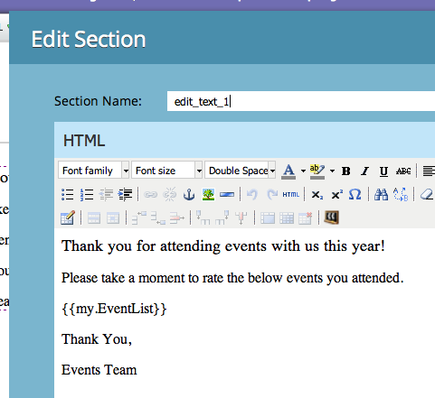

# Email Scripting

Read the [Velocity User Guide](https://velocity.apache.org/engine/devel/user-guide.html) for a detailed explanation of Velocity Template Language behavior.

[Apache Velocity](https://velocity.apache.org/) is a Java-based language for templating and scripting HTML content. Use Velocity in Marketo email scripting tokens to access data stored in opportunities and custom objects and create dynamic email content.

Velocity provides `if`/`else`, `for`, and `foreach` control flow for conditional and iterative content.

## Variables

Prefix variables with `$`. Create or update them with `#set`:

```velocity
#set($variable = "value")
```

Retrieve variable values with reference types that provide different behaviors:

```text
$variable ##outputs 'value'
$variablename ##outputs '$variablename'
${variable}name ##outputs 'valuename'
```


Quiet reference notation includes `!` after `$`. By default, Velocity leaves the reference string in place when a reference is undefined. A quiet reference emits no value when it is undefined:

```velocity
##Defined Reference

#set($foo = "bar")
$foo ##outputs "bar"

##Undefined Reference

##normal
$baz ##outputs "$baz"

##quiet
$!baz ##outputs nothing
```

For more information on how to reference variables, see the [Apache User Guide](https://velocity.apache.org/engine/devel/user-guide.html#formal-reference-notation).

## Velocity Tools

The Apache Velocity Project provides [Velocity Tools](https://velocity.apache.org/tools/devel/apidocs/overview-summary.html). These wrappers expose Java object methods through global variables available to all scripts.

- [AlternatorTool](https://velocity.apache.org/tools/devel/apidocs/org/apache/velocity/tools/generic/AlternatorTool.html)
- [ComparisonDateTool](https://velocity.apache.org/tools/devel/apidocs/org/apache/velocity/tools/generic/ComparisonDateTool.html)
- [ConversionTool](https://velocity.apache.org/tools/devel/apidocs/org/apache/velocity/tools/generic/ConversionTool.html)
- [DateTool](https://velocity.apache.org/tools/devel/apidocs/org/apache/velocity/tools/generic/DateTool.html)
- [DisplayTool](https://velocity.apache.org/tools/devel/apidocs/org/apache/velocity/tools/generic/DisplayTool.html)
- [MathTool](https://velocity.apache.org/tools/devel/apidocs/org/apache/velocity/tools/generic/MathTool.html)
- [NumberTool](https://velocity.apache.org/tools/devel/apidocs/org/apache/velocity/tools/generic/NumberTool.html)
- [EscapeTool](https://velocity.apache.org/tools/devel/apidocs/org/apache/velocity/tools/generic/EscapeTool.html)
- [LoopTool](https://velocity.apache.org/tools/devel/apidocs/org/apache/velocity/tools/generic/LoopTool.html)

For example, to use a method from `ComparisonDateTool`, access it from the `$date` variable in a script token:

```velocity
#set($birthday = $convert.parseDate("2015-08-07","yyyy-MM-dd"))
##use whenIs to determine how many days away it is
$date.whenIs($birthday).days ##outputs 1
```

## Creating a Script Token

Add Velocity scripts to emails with Email Script Tokens. Create a token in Marketing Activities within a marketing folder or program.

To use a token, the email must be a child of the program that owns the token or inherit it from a marketing folder. Go to a folder or program and select the **My Tokens** tab. Drag the Email Script option from the right menu into the token list.


Edit the token name, then select **Click to Edit** to open the editor:


In the editor, create a script that accesses variables in script-accessible objects. To add an object field reference, drag it from the right tree into the script:


## Script Embedding and Testing

After defining the script in a program My Token, reference it from an email in the Marketo email editor.



Test the script with the **Send Sample Email** action in the Marketo email designer. Select an existing lead in the **Lead** field so the script processes correctly.

When testing `$TriggerObject`, select the triggering object with the **Trigger** parameter. Marketo uses the most recently updated object of that type as the `$TriggerObject` variable.


You can also test with **Email Preview**. Select **View As: Lead Detail**, then select a lead from a static list. The preview also displays exceptions from script execution:


## Best Practices

The combined length of all Email Script Tokens in a given email may not exceed 100,000 bytes. This limit pertains to the total length of the token strings themselves (not the total length after tokens have been expanded).

- The variables referenced in the email script must exist in Marketo on one of the objects available to the script.
- You can reference first and second-level custom objects which originate from your natively integrated CRM that are directly connected to the Lead, or Contact, but not third-level custom objects. Custom Objects may not be parents of the Lead or Company
- For Marketo custom objects, you can reference second-level custom objects with Parent-Child relationship. For example `Lead - Parent <- Child`. You cannot reference second-level custom objects with Edge-Bridge relationship. for example,  `Lead <- Bridge - Edge`
- You can reference custom objects connected to a Lead, Contact, or an Account, but not more than one.
- Custom objects may only be referenced through a single connection, Lead, Contact, or Account
- Check the box in the script editor for the fields you are using, or they do not process
- For each custom object, the ten most recently updated records per person/contact are available at runtime. Records are ordered from most recently updated at index 0 to oldest at index 9. You can increase the number of available records by [following the instructions](https://experienceleague.adobe.com/en/docs/marketo/using/product-docs/administration/email-setup/change-custom-object-retrieval-limits-in-velocity-scripting).
- If you include more than one Email Script within an email, they execute top to bottom. The scope of variables defined in the first script to execute is available in subsequent scripts.
- Tools Reference: [https://velocity.apache.org/tools/2.0/index.html](https://velocity.apache.org/tools/2.0/index.html)
- A note regarding tokens that contain newline characters "\n" or "\r\n." When an email is sent via Send Sample or via a Batch Campaign, newline characters in tokens are replaced with spaces. When email is sent via Trigger Campaign, newline characters are left untouched.
- To ensure correct URL parsing, set the complete path as a variable and then print it. Do not print variables inside URL references. Include the protocol (`http://` or `https://`) separately from the rest of the URL. Output a complete anchor (`a`) tag so links can be tracked. Links output from a `for` or `foreach` loop are not tracked.

```html
<!-- Correct -->
#set($url = "www.example.com/${object.id}")
<a href="http://${url}">Link Text</a>

<!-- Correct -->
<a href="http://www.example.com/${object.id}">Link Text</a>

<!-- Incorrect -->
<a href="${url}">Link Text</a>

<!-- Incorrect -->
<a href="{{my.link}}">Link Text</a>

<!-- Incorrect -->
<a href="http://{{my.link}}">Link Text</a>
```
