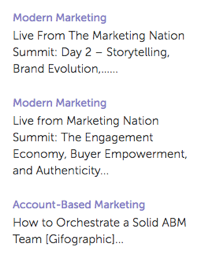

# Rich Media Recommendation

The following tags and API calls must be set up on the page that you want to display the Rich Media Recommendation template.

1. In the Page Header
    1. Have the RTP tag installed
    1. Add the GET call to the page to populate the recommendations
    1. Add the SET call to configure the template
1. In the Page Body
    1. Place the template tag (div class) in the location where you want the template to appear

More information is available [here](https://experienceleague.adobe.com/en/docs/marketo/using/product-docs/predictive-content/enabling-predictive-content/enable-predictive-content-for-web-rich-media).

## Template Tag

| Attribute | Optional/Required | Description |
| --- | --- | --- |
| class | Required | Specify that this div HTML element is RTP recommendation div. |
| data-rtp-template-id | Required | The template id. This determines the alignment of your recommendation. Use "template1" for horizontal alignment, "template2" for vertical alignment, or "template3" for vertical alignment that includes only title and description. The script injects the matching template into this `div.Permissible` values: template1, template2, template3. |

### Examples

To display your recommendations in horizontal alignment, use "template1".

```html
<div class="RTP_RCMD2" data-rtp-template-id="template1"></div>
```

To display your recommendations in vertical alignment, use "template2".

```html
<div class="RTP_RCMD2" data-rtp-template-id="template2"></div>
```

To display your recommendations in vertical alignment with title and description only, use "template3".

```html
<div class="RTP_RCMD2" data-rtp-template-id="template3"></div>
```

See screenshots of template alignments [here](#example_of_rich_media_recommendation_template_1).

## Populate Recommendation

This method populates all the rich media `<divs>` on the page with recommendations.

### Usage

`rtp('get', 'rcmd', 'richmedia');`

| Parameter | Optional/Required | Type | Description |
| --- | --- | --- | --- |
| 'get' | Required | String | Method action. |
| 'rcmd' | Required | String | Method name. |
| 'richmedia' | Required | String | Sub method name. |

## Change Template Configuration

This method changes the default configuration for template.

Note: When using this method it must be called before calling rtp('get','rcmd', 'richmedia');

### Usage

`rtp('set', 'rcmd', 'richmedia', 'template_id', conf_obj);`

| Parameter | Optional/Required | Type | Description |
| --- | --- | --- | --- |
| 'set' | Required | String | Method action. |
| 'rcmd' | Required | String | Method name. |
| 'richmedia' | Required | String | Sub Method name. |
| template_id | Optional | String | The template id for configuration changes. Use to specify settings change for only one template. |
| conf_obj | Required | Object | The new configuration. The object holds all the configurations as key/value pair. |

### Examples

This code snippet changes the title text for a template.

```javascript
rtp("set", "rcmd", "richmedia","template1",
    {
        "rcmd.title.text": "RECOMMENDED CONTENT"
    }
);
```

This code snippet shows setting categories with multiple configurations for a template.

```javascript
rtp("set", "rcmd", "richmedia",
    {
        "template1":
        {
            "rcmd.title.text": "RECOMMENDED CONTENT",
            "rcmd.general.font.family": "arial",
            "category":
            [
                "webinar",
                "blog posts",
                "pricing_page_category",
                "product_a_category"
            ]
        }
    }
);
```

NOTE: Use "category" to filter content that is displayed in the outcome of predictive content recommendations. To apply predictive content to all enabled content pieces, leave the "category" empty. If you want to recommend only specific content for the output in the Rich Media template, add a category for the content in the Set content page and associate that category within the recommendation template code. Categorizing relevant content according to sections of your website (products or solutions).

This code snippet shows setting multiple template configurations for a template.

```javascript
rtp("set", "rcmd", "richmedia",
    {
        "template1":
        {
            "rcmd.title.text": "RECOMMENDED CONTENT",
            "rcmd.general.font.family": "arial"
        }
    }
);
```

#### Configuration Properties

| Configuration | Example | Description |
| --- | --- | --- |
| rcmd.general.font.family | "rcmd.general.font.family" : "arial" | Changes the font family for all the text in the template. This property support all the CSS values by the browser type. It is possible to use a custom font family if it exists on the page. |
| rcmd.content.background.color | "rcmd.content.background.color" : "black" | Changes the background color of the template inner boxes. This property supports all the CSS values by the browser type. |
| rcmd.title.text | "rcmd.title.text" : "RECOMMENDED CONTENT" | Changes the template title. |
| rcmd.title.background.color | "rcmd.title.background.color" : "blue" | Changes the title box background color. This property supports all the css color values (color name, rgb, …) |
| rcmd.title.font.size | "rcmd.title.font.size" : "26px" | Changes the title font size. The property supports all the possible font sizes CSS value (px, em, …) |
| rcmd.title.font.color | "rcmd.title.font.color" : "white" | Changes the title font color. This property supports all the font color values (rgb, hex, …) |
| rcmd.description.font.color | "rcmd.description.font.color" : "white" | Changes the description font color. This property supports all the font color values (rgb, hex, …) |
| rcmd.cta.background.color | "rcmd.cta.background.color" : "green" | Changes the button background color. This property support all the css color value (color name, rgb, …) |
| rcmd.cta.font.color | "rcmd.cta.font.color" : "rgb(90, 84, 164)" | Changes the button font color. This property supports all the font color values (rgb, hex, …) |
| rcmd.cta.text | "rcmd.cta.text" : "Push" | Changes the button text. The text is the same for all the buttons. |
| category | "category" : ["one category"] | Changes the recommendation category this template supports. The template displays only recommendations with one of the categories set by this configuration. |

Note: The configuration support can change per template.

#### Basic Example

This example has one template with three recommendations. Copy this example into an HTML page, and then replace the RTP tag with your tag.

```html
<!DOCTYPE>
<html>
<head>
<meta http-equiv="Content-Type" content="text/html; charset=UTF-8">
<title>RTP recommendation</title>
<!-- RTP tag -->
<script type='text/javascript'>

// This tag needs to be replaced with your account tag
(function(c,h,a,f,i,e){c[a]=c[a]||function(){(c[a].q=c[a].q||[]).push(arguments)};
c[a].a=i;c[a].e=e;var g=h.createElement("script");g.async=true;g.type="text/javascript";
g.src=f+'?aid='+i;var b=h.getElementsByTagName("script")[0];b.parentNode.insertBefore(g,b);
})(window,document,"rtp","//example.rtp.com/rtp-api/v1/rtp.js","account_id");

// Send page view (required by  the recommendation)
rtp('send','view');
// Populate recommendation
rtp('get','rcmd', 'richmedia');
</script>
<!-- End of RTP tag -->
</head>
<body>
<div class="RTP_RCMD2" data-rtp-template-id="template1"></div>
</body>
</html>
```

#### Advanced Example

This example has one template with three recommendations. The template title is "RECOMMENDED CONTENT" and the button text will be "Read More". Copy this example into an HTML page, and then replace the RTP tag with your tag.

```html
<!DOCTYPE>
<html>
<head>
<meta http-equiv="Content-Type" content="text/html; charset=UTF-8">
<title>RTP recommendation</title>
<!-- RTP tag -->
<script type='text/javascript'>

// This tag needs to be replaced with your account tag
(function(c,h,a,f,i,e){c[a]=c[a]||function(){(c[a].q=c[a].q||[]).push(arguments)};
c[a].a=i;c[a].e=e;var g=h.createElement("script");g.async=true;g.type="text/javascript";
g.src=f+'?aid='+i;var b=h.getElementsByTagName("script")[0];b.parentNode.insertBefore(g,b);
})(window,document,"rtp","//example.rtp.com/rtp-api/v1/rtp.js","account_id");

// Send page view (required by  the recommendation)
rtp('send','view');
// Populate the recommendation zone
rtp('get', 'campaign',true);
// Change template configuration
rtp('set', 'rcmd', 'richmedia',
    {
        template1 :
        {
            "rcmd.title.text" : "RECOMMENDED CONTENT",
            "rcmd.cta.text" : "Read More"
        }
    }
);
// Populate recommendation
rtp('get','rcmd', 'richmedia');
</script>
<!-- End of RTP tag -->
</head>
<body>
<div class="RTP_RCMD2" data-rtp-template-id="template1"></div>
</body>
</html>
```

#### Example of Rich Media Recommendation Template #1

**Name**: template1 **Description**: Horizontal content including image, title, and description and call to action button.


#### Example of Rich Media Recommendation Template #2

**Name**: template2 **Description**: Vertical content including image, title, and description and call to action button.


#### Example of Rich Media Recommendation Template #3

**Name**: template3 **Description**: Vertical content including only title and description. On mouse hover, header changes color and is hyperlinked to content URL. Description also links to content without color change. 
