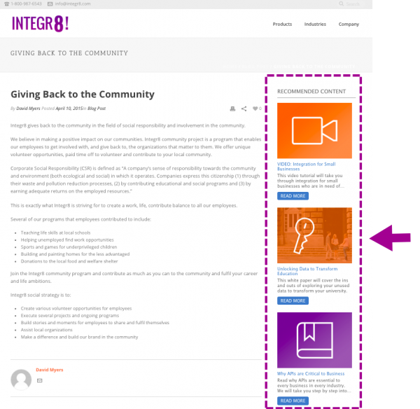

# Rich Media Recommendation

To display a Rich Media Recommendation template, add the required tags and API calls to the page.

1. In the page header:
    1. Install the RTP tag.
    1. Add the GET call that populates the recommendations.
    1. Add the SET call that configures the template.
1. In the page body:
    1. Place the template tag (div class) where you want the template to appear.

For more information, see [Enable Predictive Content for Web Rich Media](https://experienceleague.adobe.com/en/docs/marketo/using/product-docs/predictive-content/enabling-predictive-content/enable-predictive-content-for-web-rich-media).

## Template Tag

| Attribute | Optional/Required | Description |
| --- | --- | --- |
| class | Required | Identifies the div HTML element as an RTP recommendation div. |
| data-rtp-template-id | Required | Determines the recommendation alignment. Use "template1" for horizontal alignment, "template2" for vertical alignment, or "template3" for vertical alignment with only a title and description. The script injects the matching template into this `div`. Permissible values: template1, template2, template3. |

### Examples

Use "template1" to display recommendations horizontally.

```html
<div class="RTP_RCMD2" data-rtp-template-id="template1"></div>
```

Use "template2" to display recommendations vertically.

```html
<div class="RTP_RCMD2" data-rtp-template-id="template2"></div>
```

Use "template3" to display recommendations vertically with only a title and description.

```html
<div class="RTP_RCMD2" data-rtp-template-id="template3"></div>
```

See the [template alignment examples](#example_of_rich_media_recommendation_template_1).

## Populate Recommendation

This method populates all rich media `divs` on the page with recommendations.

### Usage

`rtp('get', 'rcmd', 'richmedia');`

| Parameter | Optional/Required | Type | Description |
| --- | --- | --- | --- |
| 'get' | Required | String | Method action. |
| 'rcmd' | Required | String | Method name. |
| 'richmedia' | Required | String | Sub method name. |

## Change Template Configuration

This method changes the default template configuration.

Call this method before calling rtp('get','rcmd', 'richmedia');

### Usage

`rtp('set', 'rcmd', 'richmedia', 'template_id', conf_obj);`

| Parameter | Optional/Required | Type | Description |
| --- | --- | --- | --- |
| 'set' | Required | String | Method action. |
| 'rcmd' | Required | String | Method name. |
| 'richmedia' | Required | String | Sub Method name. |
| template_id | Optional | String | The template id for configuration changes. Use to specify settings change for only one template. |
| conf_obj | Required | Object | The new configuration. The object holds all the configurations as key/value pair. |

### Examples

This example changes the title text for a template.

```javascript
rtp("set", "rcmd", "richmedia","template1",
    {
        "rcmd.title.text": "RECOMMENDED CONTENT"
    }
);
```

This example sets categories and multiple configuration properties for a template.

```javascript
rtp("set", "rcmd", "richmedia",
    {
        "template1":
        {
            "rcmd.title.text": "RECOMMENDED CONTENT",
            "rcmd.general.font.family": "arial",
            "category":
            [
                "webinar",
                "blog posts",
                "pricing_page_category",
                "product_a_category"
            ]
        }
    }
);
```

Use "category" to filter the content displayed in predictive content recommendations. To use predictive content for all enabled content, leave "category" empty.

To recommend only specific content in the Rich Media template, add a category for the content on the Set content page. Then associate that category with the recommendation template code. For example, categorize relevant content by the product or solution sections of your website.

This example sets multiple configuration properties for a template.

```javascript
rtp("set", "rcmd", "richmedia",
    {
        "template1":
        {
            "rcmd.title.text": "RECOMMENDED CONTENT",
            "rcmd.general.font.family": "arial"
        }
    }
);
```

#### Configuration Properties

| Configuration | Example | Description |
| --- | --- | --- |
| rcmd.general.font.family | "rcmd.general.font.family" : "arial" | Changes the font family for all the text in the template. This property support all the CSS values by the browser type. It is possible to use a custom font family if it exists on the page. |
| rcmd.content.background.color | "rcmd.content.background.color" : "black" | Changes the background color of the template inner boxes. This property supports all the CSS values by the browser type. |
| rcmd.title.text | "rcmd.title.text" : "RECOMMENDED CONTENT" | Changes the template title. |
| rcmd.title.background.color | "rcmd.title.background.color" : "blue" | Changes the title box background color. This property supports all the css color values (color name, rgb, …) |
| rcmd.title.font.size | "rcmd.title.font.size" : "26px" | Changes the title font size. The property supports all the possible font sizes CSS value (px, em, …) |
| rcmd.title.font.color | "rcmd.title.font.color" : "white" | Changes the title font color. This property supports all the font color values (rgb, hex, …) |
| rcmd.description.font.color | "rcmd.description.font.color" : "white" | Changes the description font color. This property supports all the font color values (rgb, hex, …) |
| rcmd.cta.background.color | "rcmd.cta.background.color" : "green" | Changes the button background color. This property support all the css color value (color name, rgb, …) |
| rcmd.cta.font.color | "rcmd.cta.font.color" : "rgb(90, 84, 164)" | Changes the button font color. This property supports all the font color values (rgb, hex, …) |
| rcmd.cta.text | "rcmd.cta.text" : "Push" | Changes the button text. The text is the same for all the buttons. |
| category | "category" : ["one category"] | Changes the recommendation category this template supports. The template displays only recommendations with one of the categories set by this configuration. |

Configuration support can vary by template.

#### Basic Example

This example displays three recommendations in one template. Copy the example into an HTML page, and then replace the RTP tag with your tag.

```html
<!DOCTYPE>
<html>
<head>
<meta http-equiv="Content-Type" content="text/html; charset=UTF-8">
<title>RTP recommendation</title>
<!-- RTP tag -->
<script type='text/javascript'>

// This tag needs to be replaced with your account tag
(function(c,h,a,f,i,e){c[a]=c[a]||function(){(c[a].q=c[a].q||[]).push(arguments)};
c[a].a=i;c[a].e=e;var g=h.createElement("script");g.async=true;g.type="text/javascript";
g.src=f+'?aid='+i;var b=h.getElementsByTagName("script")[0];b.parentNode.insertBefore(g,b);
})(window,document,"rtp","//example.rtp.com/rtp-api/v1/rtp.js","account_id");

// Send page view (required by  the recommendation)
rtp('send','view');
// Populate recommendation
rtp('get','rcmd', 'richmedia');
</script>
<!-- End of RTP tag -->
</head>
<body>
<div class="RTP_RCMD2" data-rtp-template-id="template1"></div>
</body>
</html>
```

#### Advanced Example

This example displays three recommendations in one template. The template title is "RECOMMENDED CONTENT" and the button text is "Read More". Copy the example into an HTML page, and then replace the RTP tag with your tag.

```html
<!DOCTYPE>
<html>
<head>
<meta http-equiv="Content-Type" content="text/html; charset=UTF-8">
<title>RTP recommendation</title>
<!-- RTP tag -->
<script type='text/javascript'>

// This tag needs to be replaced with your account tag
(function(c,h,a,f,i,e){c[a]=c[a]||function(){(c[a].q=c[a].q||[]).push(arguments)};
c[a].a=i;c[a].e=e;var g=h.createElement("script");g.async=true;g.type="text/javascript";
g.src=f+'?aid='+i;var b=h.getElementsByTagName("script")[0];b.parentNode.insertBefore(g,b);
})(window,document,"rtp","//example.rtp.com/rtp-api/v1/rtp.js","account_id");

// Send page view (required by  the recommendation)
rtp('send','view');
// Populate the recommendation zone
rtp('get', 'campaign',true);
// Change template configuration
rtp('set', 'rcmd', 'richmedia',
    {
        template1 :
        {
            "rcmd.title.text" : "RECOMMENDED CONTENT",
            "rcmd.cta.text" : "Read More"
        }
    }
);
// Populate recommendation
rtp('get','rcmd', 'richmedia');
</script>
<!-- End of RTP tag -->
</head>
<body>
<div class="RTP_RCMD2" data-rtp-template-id="template1"></div>
</body>
</html>
```

#### Example of Rich Media Recommendation Template #1

**Name**: template1

**Description**: Horizontal content that includes an image, title, description, and call-to-action button.


#### Example of Rich Media Recommendation Template #2

**Name**: template2

**Description**: Vertical content that includes an image, title, description, and call-to-action button.



#### Example of Rich Media Recommendation Template #3

**Name**: template3

**Description**: Vertical content that includes only a title and description. On mouse hover, the header changes color and links to the content URL. The description also links to the content without changing color.


