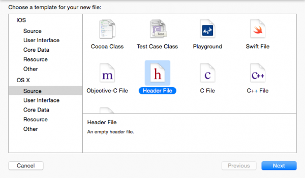
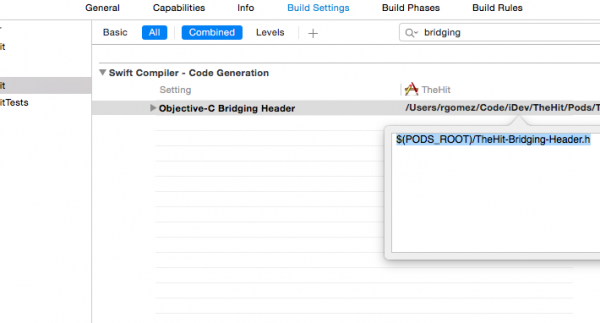

# Installation

Installation instructions for Marketo Mobile SDK. The steps below are required to send Push Notifications and/or In-App Messages.

## Install Marketo SDK on iOS

### Prerequisites

1. [Add an application in Marketo Admin](https://experienceleague.adobe.com/en/docs/marketo/using/product-docs/mobile-marketing/admin/add-a-mobile-app) (obtain your application Secret Key and Munchkin Id)
1. [Setup Push Notifications](push-notifications.md) (optional)

### Install Framework via CocoaPods

1. Install CocoaPods. `$ sudo gem install cocoapods`
1. Change directory to your project directory and create a Podfile with smart defaults. `$ pod init`
1. Open your Podfile. `$ open -a Xcode Podfile`
1. Add the following line to your Podfile. `$ pod 'Marketo-iOS-SDK'`
1. Save and close your Podfile.
1. Download and install Marketo iOS SDK. `$ pod install`
1. Open workspace in Xcode. `$ open App.xcworkspace`

### Install Framework using Swift Package Manager

1. Select your project from the Project Navigator and under "Add Package Dependency", click '+' as shown below :

    

1. Add Marketo package from this Repo. Add this URL for this repository: [https://github.com/Marketo/ios-sdk](https://github.com/Marketo/ios-sdk).

    

1. Now add the Resource bundle as shown: Locate `MarketoFramework.XCframework` in project navigator and open it in Finder. Drag and drop `MKTResources.bundle` to Copy Bundle Resources.

### Setup Swift Bridging Header

1. Go to File > New > File and Select "Header File".

    

1. Name the file "<_ProjectName_>-Bridging-Header".

1. Go to Project > Target > Build Phases > Swift Compiler > Code Generation. Add the following path to Objective-Bridging Header:

    `$(PODS_ROOT)/<_ProjectName_>-Bridging-Header.h`

    

## Initialize SDK

Before you can use the Marketo iOS SDK, you must initialize it with your Munchkin Account Id and App Secret Key. You can find each of these in the Marketo Admin area underneath "Mobile Apps and Devices".

1. Open your AppDelegate.m file (Objective-C) or Bridging file (Swift) and import the Marketo.h header file.

    ```
    #import <MarketoFramework/MarketoFramework.h>
    ```

1. Paste the following code inside the `application:didFinishLaunchingWithOptions`: function.

    Note that we must pass "native" as framework type for Native Apps.

<Tab orientation="horizontal" slots="heading, content" repeat="2" />

### Objective C

```objectivec
Marketo *sharedInstance = [Marketo sharedInstance];

[sharedInstance initializeWithMunchkinID:@"munchkinAccountId" appSecret:@"secretKey" mobileFrameworkType:@"native" launchOptions:launchOptions];
```

### Swift

```swift
let sharedInstance: Marketo = Marketo.sharedInstance()

sharedInstance.initialize(withMunchkinID: "munchkinAccountId", appSecret: "secretKey", mobileFrameworkType: "native", launchOptions: launchOptions)
```

1. Replace `munkinAccountId` and `secretKey` above using your "Munchkin Account ID" and "Secret Key" which are found in the Marketo **Admin** > **Mobile Apps and Devices** section.

## iOS Test Devices

1. Select Project > Target > Info > URL Types.
1. Add identifier: ${PRODUCT_NAME}
1. Set URL Schemes: `mkto-<Secret Key_>`
1. Include application:openURL:sourceApplication:annotation: to AppDelegate.m file (Objective-C)

## Handle Custom Url Type in AppDelegate

<Tab orientation="horizontal" slots="heading, content" repeat="2" />

### Objective C

```objectivec
- (BOOL)application:(UIApplication *)app
            openURL:(NSURL *)url
            options:(NSDictionary<UIApplicationOpenURLOptionsKey,id> *)options{

    return [[Marketo sharedInstance] application:app
                                         openURL:url
                                         options:options];
}

```

### Swift

```swift
private func application(_ app: UIApplication, open url: URL, options: [UIApplication.OpenURLOptionsKey : Any] = [:]) -> Bool
    {
        return Marketo.sharedInstance().application(app, open: url, options: options)
    }

```

## How to Install Marketo SDK on Android

### Prerequisites

1. [Add an application in Marketo Admin](https://experienceleague.adobe.com/en/docs/marketo/using/product-docs/mobile-marketing/admin/add-a-mobile-app) (obtain your application Secret Key and Munchkin Id)
1. [Setup Push Notifications](push-notifications.md#android_setup_push) (optional)
1. [Download Marketo SDK for Android](https://codeload.github.com/Marketo/android-sdk/zip/refs/heads/master)

### Android SDK Setup with Gradle

1. In the application level build.gradle file, under the dependencies section add

   `implementation 'com.marketo:MarketoSDK:0.8.9'`

1. The root `build.gradle` file should have

    ```
    buildscript {
        repositories {
            google()
            mavenCentral()
        }
    ```

1. Sync your Project with Gradle Files

### Configure Permissions

Open `AndroidManifest.xml` and add following permissions. Your app must request the "INTERNET" and "ACCESS_NETWORK_STATE" permissions. If your app already requests these permissions, then skip this step.

```xml
<uses‐permission android:name="android.permission.INTERNET"></uses‐permission>
<uses‐permission android:name="android.permission.ACCESS_NETWORK_STATE"></uses‐permission>
```

### Initialize SDK

1. Open the Application or Activity class in your app and import the Marketo SDK into your Activity before setContentView or in Application Context.

    ```java
    // Initialize Marketo
    Marketo marketoSdk = Marketo.getInstance(getApplicationContext());
    marketoSdk.initializeSDK("native","munchkinAccountId","secretKey");
    ```

1. ProGuard Configuration (Optional)

    If you are using ProGuard for your app, then add the following lines in your `proguard.cfg` file. The file is located within your project folder. Adding this code excludes the Marketo SDK from the obfuscation process.

    ```
    -dontwarn com.marketo.*
    -dontnote com.marketo.*
    -keep class com.marketo.`{ *; }
    ```

## Android Test Devices

Add "MarketoActivity" to `AndroidManifest.xml` file inside application tag.

```xml
<activity android:name="com.marketo.MarketoActivity"  android:configChanges="orientation|screenSize" >
    <intent-filter android:label="MarketoActivity" >
        <action  android:name="android.intent.action.VIEW"/>
        <category  android:name="android.intent.category.DEFAULT"/>
        <category  android:name="android.intent.category.BROWSABLE"/>
        <data android:host="add_test_device" android:scheme="mkto" />
    </intent-filter>
</activity>
```

## Firebase Cloud Messaging Support

The MME Software Development Kit (SDK) for Android has been updated to a more modern, stable, and scalable framework that contains more flexibility and new engineering features for your Android app developer.

Android app developers can now directly use Google's [Firebase Cloud Messaging](https://firebase.google.com/docs/cloud-messaging/) (FCM) with this SDK.

### Adding FCM to your Application

1. Integrate latest Marketo Android SDK in Android App.  Steps are available at [GitHub](https://github.com/Marketo/android-sdk).
1. Configure Firebase App on Firebase Console.
    1. Create/Add a Project on [](https://accounts.google.com/ServiceLogin?passive=1209600&osid=1&continue=https://console.firebase.google.com/&followup=https://console.firebase.google.com/)Firebase Console.
        1. In the [Firebase console](https://accounts.google.com/ServiceLogin?passive=1209600&osid=1&continue=https://console.firebase.google.com/&followup=https://console.firebase.google.com/), select `Add Project`.
        1. Select your GCM project from the list of existing Google Cloud projects, and select `Add Firebase`.
        1. In the Firebase welcome screen, select `Add Firebase to your Android App`.
        1. Provide your package name and SHA-1, and select `Add App`. A new `google-services.json` file for your Firebase app is downloaded.
        1. Select `Continue` and follow the detailed instructions for adding the Google Services plugin in Android Studio.

    1. Navigate to 'Project Settings' in Project Overview
        1. Click 'General' tab. Download the 'google-services.json' file.
        1. Click on 'Cloud Messaging' tab. Copy 'Server Key' and 'Sender ID'. Provide these 'Server Key' and 'Sender ID' to Marketo.
    1. Configure FCM changes in Android App
        1. Switch to the Project view in Android Studio to see your project root directory
            1. Move the downloaded 'google-services.json' file into your Android app module root directory
            1. In Project-level build.gradle, add the following:

                ```
                buildscript {
                  dependencies {
                    classpath 'com.google.gms:google-services:4.0.0'
                  }
                }
                ```

            1. In App-level build.gradle, add the following:

                ```
                dependencies {
                  compile 'com.google.firebase:firebase-core:17.4.0'
                }
                // Add to the bottom of the file
                apply plugin: 'com.google.gms.google-services'
                ```

            1. Finally, select **Sync now** in the bar that appears in the ID
    1. Edit your app's manifest The FCM SDK automatically adds all required permissions and the required receiver functionality. Make sure to remove the following obsolete (and potentially harmful, as they may cause message duplication) elements from your app's manifest:

        ```xml
        <uses-permission android:name="android.permission.WAKE_LOCK" />
        <permission android:name="<your-package-name>.permission.C2D_MESSAGE" android:protectionLevel="signature" />
        <uses-permission android:name="<your-package-name>.permission.C2D_MESSAGE" />

        ...

        <receiver>
          android:name="com.google.android.gms.gcm.GcmReceiver"
          android:exported="true"
          android:permission="com.google.android.c2dm.permission.SEND"
          <intent-filter>
            <action android:name="com.google.android.c2dm.intent.RECEIVE" />
            <category android:name="<your-package-name> />
          </intent-filter>
        </receiver>
        ```
