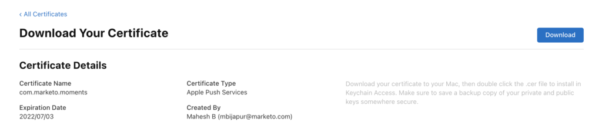
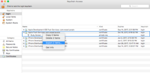
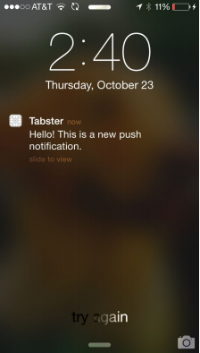
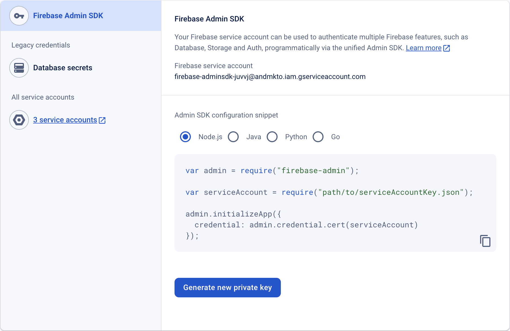

# Push Notifications

Enable push notifications for iOS or Android apps that use the Marketo Mobile SDK.

## Setup Push Notification on iOS

There are three steps to enable push notifications:

1. Configure push notifications in your Apple Developer account.
1. Enable push notifications in xCode.
1. Enable push notifications in the app with the Marketo SDK.

### Configure Push Notifications on Apple Developer Account

1. Log in to the Apple Developer [Member Center](https://developer.apple.com/membercenter).
1. Select "Certificates, Identifiers & Profiles".
1. Select the "Certificates->All" folder under "iOS, tvOS, watchOS".
1. Select the "+" next to certificates in the upper-left corner. 
1. Select "Apple Push Notification service SSL (Sandbox & Production)", and then select Continue.
1. Select the application identifier used to build the app.
1. Create and upload a CSR to generate the push certificate. 
1. Download the certificate and double-click it to install. 
1. Open "Keychain Access", right-click the certificate, and export both items to the `.p12` file.
1. Upload this file through Marketo Admin Console to configure notifications.
1. Update app provisioning profiles.

### Enable Push Notifications in xCode

Turn on the push notification capability in the xCode project.

### Enable Push Notifications in App with Marketo SDK

Add the following code to the `AppDelegate.m` file to deliver push notifications to customer devices.

**Note** - If you use the Adobe Launch extension, use `ALMarketo` as the class name.

Add the following import to `AppDelegate.h`.

<Tab orientation="horizontal" slots="heading, content" repeat="2" />

### Objective C

```objectivec
#import <UserNotifications/UserNotifications.h>
```

### Swift

```swift
import UserNotifications
```

Add `UNUserNotificationCenterDelegate` to `AppDelegate` as shown below.

<Tab orientation="horizontal" slots="heading, content" repeat="2" />

### Objective C

```objectivec
@interface AppDelegate : UIResponder <UIApplicationDelegate, UNUserNotificationCenterDelegate>
```

### Swift

```swift
class AppDelegate: UIResponder, UIApplicationDelegate , UNUserNotificationCenterDelegate
```

Add the following code to initialize the push notification service.

<Tab orientation="horizontal" slots="heading, content" repeat="2" />

### Objective C

```objectivec
BOOL)application:(UIApplication *)application didFinishLaunchingWithOptions:(NSDictionary *)launchOptions {
UNUserNotificationCenter *center = [UNUserNotificationCenter currentNotificationCenter];
        center.delegate = self;
        [center requestAuthorizationWithOptions:(UNAuthorizationOptionSound | UNAuthorizationOptionAlert | UNAuthorizationOptionBadge) completionHandler:^(BOOL granted, NSError * _Nullable error){
            if(!error){
                dispatch_async(dispatch_get_main_queue(), ^{
                    [[UIApplication sharedApplication] registerForRemoteNotifications];
                });
            }
        }];

    return YES;
}

```

### Swift

```swift
func application(_ application: UIApplication, didFinishLaunchingWithOptions launchOptions: [UIApplication.LaunchOptionsKey: Any]?) -> Bool {

    UNUserNotificationCenter.current().requestAuthorization(options: [.alert, .sound,    .badge]) { granted, error in
            if let error = error {
                print("\(error.localizedDescription)")
            } else {
                DispatchQueue.main.async {
                    application.registerForRemoteNotifications()
                }
            }
        }

        return true
}
```

Call this method to start registration with Apple Push Service. If registration succeeds, the app calls the App delegate object's `application:didRegisterForRemoteNotificationsWithDeviceToken:` method and passes it a device token.

If registration fails, the app calls its App delegate's `application:didFailToRegisterForRemoteNotificationsWithError:` method instead.

Register the push token with Marketo. The device token must be registered to receive push notifications from Marketo.

<Tab orientation="horizontal" slots="heading, content" repeat="2" />

### Objective C

```objectivec
- (void)application:(UIApplication *)application didRegisterForRemoteNotificationsWithDeviceToken:(NSData *)deviceToken {
    // Register the push token with Marketo
    [[Marketo sharedInstance] registerPushDeviceToken:deviceToken];
}
```

### Swift

```swift
func application(_ application: UIApplication, didRegisterForRemoteNotificationsWithDeviceToken deviceToken: Data) {
    // Register the push token with Marketo
    Marketo.sharedInstance().registerPushDeviceToken(deviceToken)
}
```

You can also unregister the token when the user logs out.

<Tab orientation="horizontal" slots="heading, content" repeat="2" />

### Objective C

```objectivec
[[Marketo sharedInstance] unregisterPushDeviceToken];
```

### Swift

```swift
Marketo.sharedInstance().unregisterPushDeviceToken
```

To re-register the push token, extract the code from step 3 into an AppDelegate method. Call that method from the ViewController login method.

Handle the push notification after registering the device token with Marketo.

<Tab orientation="horizontal" slots="heading, content" repeat="2" />

### Objective C

```objectivec
- (void)application:(UIApplication *)application didReceiveRemoteNotification:(NSDictionary *)userInfo
{
    [[Marketo sharedInstance] handlePushNotification:userInfo];
}
```

### Swift

```swift
func application(_ application: UIApplication, didReceiveRemoteNotification userInfo: [AnyHashable : Any]) {
    Marketo.sharedInstance().handlePushNotification(userInfo)
}

```

Add the following method to AppDelegate.

Use this method to display an alert, play a sound, or increase the badge while the app is in the foreground. Call the appropriate completionHandler in this method.

<Tab orientation="horizontal" slots="heading, content" repeat="2" />

### Objective C

```objectivec
-(void)userNotificationCenter:(UNUserNotificationCenter *)center
    willPresentNotification:(UNNotification *)notification
        withCompletionHandler:(void (^)(UNNotificationPresentationOptions options))completionHandler{

    completionHandler(UNAuthorizationOptionSound | UNAuthorizationOptionAlert | UNAuthorizationOptionBadge);
}
```

### Swift

```swift
func userNotificationCenter(_ center: UNUserNotificationCenter,
            willPresent notification: UNNotification, withCompletionHandler completionHandler: @escaping (
    UNNotificationPresentationOptions) -> Void) {
    completionHandler([.alert, .sound,.badge])
}
```

Handle newly received push notifications in AppDelegate.

The delegate calls this method when the user responds to a notification by opening the application, dismissing the notification, or choosing a UNNotificationAction. Set the delegate before the application returns from applicationDidFinishLaunching:.

<Tab orientation="horizontal" slots="heading, content" repeat="2" />

### Objective C

```objectivec
- (void)userNotificationCenter:(UNUserNotificationCenter *)center
didReceiveNotificationResponse:(UNNotificationResponse *)response withCompletionHandler:(void(^)(void))completionHandler {
    [[Marketo sharedInstance] userNotificationCenter:center didReceiveNotificationResponse:response withCompletionHandler:completionHandler];
}
```

### Swift

```swift
func userNotificationCenter(_ center: UNUserNotificationCenter,
                                didReceive response: UNNotificationResponse,
                                withCompletionHandler
                                completionHandler: @escaping () -> Void) {
        Marketo.sharedInstance().userNotificationCenter(center, didReceive: response, withCompletionHandler: completionHandler)
}
```

Track push notifications.

If the app is in the background or inactive, the device receives a push notification as shown below. Marketo tracks when the user selects the notification.



When the device receives a push notification, it passes the notification to the `application:didReceiveRemoteNotification:` callback on the App delegate.

The following Marketo activity log shows app events and push notification events.


## Setup Push Notification on Android

1. Add the following permissions inside the application tag.

    Open `AndroidManifest.xml` and add the following permissions. Your app must request the "INTERNET" and "ACCESS_NETWORK_STATE" permissions. Skip this step if the app already requests them.

    ```xml
    <uses‐permission android:name="android.permission.INTERNET"/>
    <uses‐permission android:name="android.permission.ACCESS_NETWORK_STATE"/>

    <!‐‐Following permissions are required for push notification.‐‐>
    <uses-permission android:name="android.permission.GET_ACCOUNTS"/>
    <!‐‐Keeps the processor from sleeping when a message is received.‐‐>
    <uses-permission android:name="android.permission.WAKE_LOCK"/>
    <permission android:name="<PACKAGE_NAME>.permission.C2D_MESSAGE" android:protectionLevel="signature" />
    <uses-permission android:name="<PACKAGE_NAME>.permission.C2D_MESSAGE" />
    <!-- This app has permission to register and receive data message. -->
    <uses-permission android:name="com.google.android.c2dm.permission.RECEIVE" />
    ```

1. Set up FCM with HTTPv1.

   - Enable MME FCM HTTPv1 in Marketo feature manager. 
   - Upload the Service Account Json file for the app in MLM.
   - Download the Service Account Json file from Firebase Console. 
   - Wait one hour after uploading the Service Account Json file in Marketo before sending push notifications.

## Android Test Devices

Add Marketo Activity to the manifest file inside the application tag.

```xml
<activity android:name="com.marketo.MarketoActivity"  android:configChanges="orientation|screenSize">
    <intent-filter android:label="MarketoActivity">
        <action  android:name="android.intent.action.VIEW"/>
        <category  android:name="android.intent.category.DEFAULT"/>
        <category  android:name="android.intent.category.BROWSABLE"/>
        <data android:host="add_test_device" android:scheme="mkto"/>
    </intent-filter/>
</activity/>
```

## Register Marketo Push Service

1. Add the Firebase messaging service to `AndroidManifest.xml` before the closing application tag.

    ```xml
    <meta-data
        android:name="com.google.android.gms.version"
        android:value="@integer/google_play_services_version" />
    <service android:name=".MyFirebaseMessagingService">
    <intent-filter>
    <action android:name="com.google.firebase.INSTANCE_ID_EVENT"/>
    <action android:name="com.google.firebase.MESSAGING_EVENT"/>
    </intent-filter>
    </service>
    ```

1. Add the Marketo SDK methods to `MyFirebaseMessagingService` as follows.

    ```java
    import com.marketo.Marketo;

    public class MyFirebaseMessagingService extends FirebaseMessagingService {

        @Override
        public void onNewToken(String s) {
            super.onNewToken(s);
            Marketo marketoSdk = Marketo.getInstance(this.getApplicationContext());
            marketoSdk.setPushNotificaitonToken(s);
            // Add your code here...
        }

        @Override
        public void onMessageReceived(RemoteMessage remoteMessage) {
            Marketo marketoSdk = Marketo.getInstance(this.getApplicationContext());
            marketoSdk.showPushNotificaiton(remoteMessage);
            // Add your code here...
        }

    }
    ```

    **Note** - If you use the Adobe extension, add the following code.

    ```java
    import com.marketo.Marketo;

    public class MyFirebaseMessagingService extends FirebaseMessagingService {

        @Override
        public void onNewToken(String token) {
            super.onNewToken(token);
            ALMarketo.setPushNotificationToken(token);
            // Add your code here...
        }

        @Override
        public void onMessageReceived(RemoteMessage remoteMessage) {
            ALMarketo.showPushNotification(remoteMessage);
            // Add your code here...
        }

    }
    ```

**NOTE**: The FCM SDK automatically adds the required permissions and receiver functionality. If you used a previous SDK version, remove the following obsolete elements, which might cause message duplication.

```xml
<receiver android:name="com.marketo.MarketoBroadcastReceiver" android:permission="com.google.android.c2dm.permission.SEND">
    <intent-filter>
        <!‐‐Receives the actual messages.‐‐>
        <action android:name="com.google.android.c2dm.intent.RECEIVE"/>
        <!‐‐Register to enable push notification‐‐>
        <action android:name="com.google.android.c2dm.intent.REGISTRATION"/>
        <!‐‐‐Replace YOUR_PACKAGE_NAME with your own package name‐‐>
        <category android:name="YOUR_PACKAGE_NAME"/>
    </intent-filter>
</receiver>

<!‐‐Marketo service to handle push registration and notification‐‐>
<service android:name="com.marketo.MarketoIntentService"/>
```

1. Initialize Marketo Push. After saving the configuration, create or open the Application class and add the following code. Get the sender ID from Firebase Console.

    ```java
    Marketo marketoSdk = Marketo.getInstance(getApplicationContext());

    // Enable push notification here. The push notification channel name can by any string
    marketoSdk.initializeMarketoPush(SENDER_ID,"ChannelName");
    ```

    If you use the Adobe Launch extension, use the following code.

    ```java
    // Enable push notification here. The push notification channel name can by any string
    ALMarketo.initializeMarketoPush(SENDER_ID,"ChannelName");
    ```

    If you do not have a SENDER_ID, then enable Google Cloud Messaging Service by completing the steps detailed in [this tutorial](https://developers.google.com/cloud-messaging/).

    You can also unregister the token when the user logs out.

    ```java
    marketoSdk.uninitializeMarketoPush();
    ```

    If you use the Adobe Launch extension, use the following code.

    ```java
    ALMarketo.uninitializeMarketoPush();
    ```

    Note: To re-register the push token, extract the code from step 3 into an AppDelegate method. Call that method from the ViewController login method.

1. Optional: Set a notification icon. Call the following method to configure a custom notification icon.

    ```java
    MarketoConfig.Notification config = new MarketoConfig.Notification();
    // Optional bitmap for honeycomb and above
    config.setNotificationLargeIcon(bitmap);

    // Required icon Resource ID
    config.setNotificationSmallIcon(R.drawable.notification_small_icon);

    // Set the configuration
    //Use the static methods on ALMarketo class when using Adobe Extension
    Marketo.getInstance(context).setNotificationConfig(config);

    // Get the configuration set
    Marketo.getInstance(context).getNotificationConfig();
    ```

## Troubleshooting

If mobile push messages do not work as expected, check the common configuration issues before investigating the implementation details.

### Push Message is Not Showing Up

Check whether push messages are disabled on the device. Mobile users can control whether they receive messages for each app, and developers or marketers might disable messages during development.

Check whether the app is open and active. When the app is active, mobile push messages do not appear on the screen. They appear in the app's "local notifications" area instead.

### View the Activity Logs in Marketo

Use the Marketo Activity logs to verify that a message was sent.

Review the activity records for a person who should have received the message. If the message was sent, the activity log contains a record. If no record exists, check the iOS certificate or Android API key configuration in Marketo.

### Certificate or Key is Invalid

Verify that the correct certificate is loaded for Sandbox or Production. If necessary, re-export the iOS certificates or Android keys and reload them into Marketo.

### .p12 file is Missing a Certificate or Key (iOS)

When you export the certificate, export both the key and the certificate.

### Provisioning Profiles Out-of-Date (iOS)

After adding a device, update the provisioning profiles and generate new certificates. Point the Xcode project to the correct profiles and certificates, and import the certificates into Marketo.

### Cannot Upload iOS Certificate (IOS)

Ensure that the password used to export the certificate does not contain spaces. For example, instead of this:

`Hello World 123`

use this:

`HelloWorld123`

### Troubleshooting iOS Certificates

For sandbox applications, use a "developer" or "universal" certificate. For production applications, upload a valid "distribution" or "universal" certificate.

### Push Bounce / Invalid Token

A registration token can become invalid in the following scenarios:

- If the client app un-registers with GCM.
- If the client app is automatically unregistered, which can happen if the user uninstalls the application. For example, on iOS, if the APNS Feedback Service reported the APNS token as invalid.
- If the registration token expires. For example, Google might decide to refresh registration tokens, or the APNS token has expired for iOS devices.
- If the client app is updated but the new version is not configured to receive messages.
