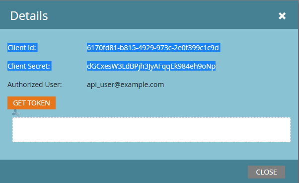

# Authentication

Marketo REST APIs use 2-legged OAuth 2.0 for authentication. A custom service provides the Client ID and Client Secret used to obtain an access token.

Each custom service belongs to an API-Only user. The user's roles and permissions authorize the service to perform specific actions. An access token belongs to a single custom service, and its expiration is independent of tokens for other custom services in the instance.

## Creating an Access Token

To find the `Client ID` and `Client Secret`, go to **Admin** > **Integration** > **LaunchPoint**. Select the custom service, and then select **View Details**.




To find the `Identity URL`, go to **Admin** > **Integration** > **Web Services**. The URL appears in the REST API section.

Create an access token with an HTTP GET or POST request:

```http
GET <Identity URL>/oauth/token?grant_type=client_credentials&client_id=<Client Id>&client_secret=<Client Secret>
```

If your request was valid, you receive a JSON response similar to the following:

```json
{
    "access_token": "cdf01657-110d-4155-99a7-f986b2ff13a0:int",
    "token_type": "bearer",
    "expires_in": 3599,
    "scope": "apis@acmeinc.com"
}
```

The response contains the following fields:

- `access_token`: The token that you pass with subsequent calls to authenticate with the target instance.
- `token_type`: The OAuth authentication method.
- `expires_in`: The remaining lifespan of the current token, in seconds. A new access token has a lifespan of 3,600 seconds, or one hour.
- `scope`: The user who owns the custom service used to authenticate.

## Using an Access Token

Every REST API call must include an access token in an HTTP header.

<InlineAlert slots="text" variant="warning" />

Support for authentication using the `access_token` query parameter is being removed on August 31, 2026. If your project uses a query parameter to pass the access token, it should be updated to use the [Authorization header](https://experienceleague.adobe.com/en/docs/marketo-developer/marketo/rest/authentication#using-an-access-token) as soon as possible. New development should use the `Authorization` header exclusively.

### Switching to the Authorization header

To replace the `access_token` query parameter with an Authorization header, update how the request sends the token.

The following cURL example sends the `access_token` value as a form parameter with the `-F` flag:

```bash
curl ...  -F access_token=<Access Token> <REST API Endpoint Base URL>/bulk/v1/apiCall.json
```

The following example sends the same value in the `Authorization: Bearer` HTTP header with the `-H` flag:

```bash
curl ... -H 'Authorization: Bearer <Access Token>' <REST API Endpoint Base URL>/bulk/v1/apiCall.json
```

## Tips and Best Practices

Store the access token and expiration period from the Identity response. Managing token expiration helps prevent unexpected authentication errors during normal operation.

Before making a REST call, check the token's remaining lifespan. If the token is expired, renew it by calling the [Identity](https://developer.adobe.com/marketo-apis/api/identity#tag/Identity) endpoint. Proactive renewal prevents failures caused by expired tokens and makes REST call latency more predictable, which is important for end-user-facing applications.

Authentication errors return the following codes:

- `602`: The access token is expired.
- `601`: The access token is invalid.

If the client receives either code, renew the token by calling the Identity endpoint.

If you call the Identity endpoint before the token expires, the response returns the same token and its remaining lifespan.

Access tokens belong to custom services, not users. If credentials from two different services produce Identity responses scoped to the same user, their access tokens and expiration periods remain independent.

When an application uses multiple credential sets, use the Client Id as a key to manage each token independently.
