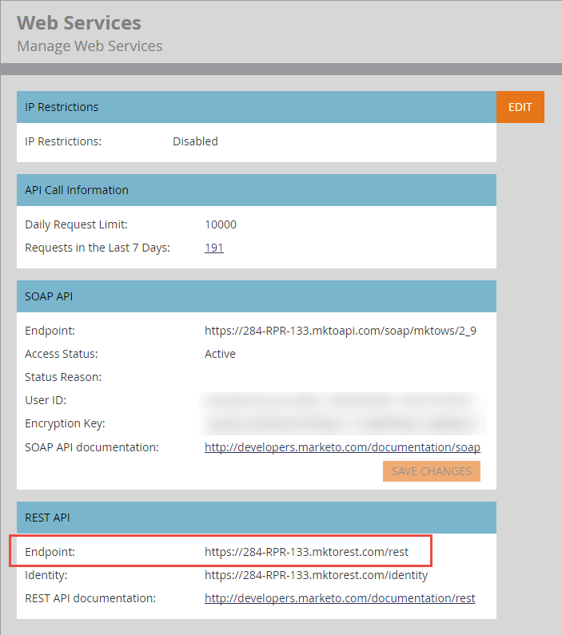

# Base URL

Each API call in the [Endpoint Reference](endpoint-reference.md) specifies the REST method, path, resource, and parameters. Append these components to the base URL to form a request.

The following is an example of a well-formed REST URL:

`https://284-RPR-133.mktorest.com/rest/v1/lead/318581.json?fields=email,firstName,lastName`

The example contains the following components:

- **Base URL:** `https://284-RPR-133.mktorest.com/rest`
- **Path:** `/v1/lead/`
- **Resource:** `318582.json`
- **Query parameter:** `fields=email,firstName,lastName`

The base URL contains the account ID, also known as the Munchkin ID, and is unique to each Marketo subscription.

To find the base URL, log in to Marketo and go to **Admin** > **Integration** > **Web Services**. The base URL is labeled "Endpoint:" in the "REST API" section, as shown in the following image.

Copy the base URL and include it in the URL for each REST API call.
