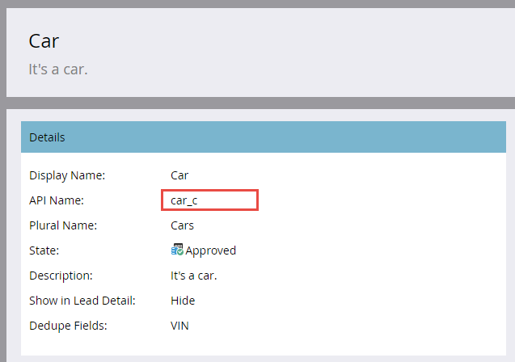

# Bulk Custom Object Import

[Bulk Custom Object Import Endpoint Reference](https://developer.adobe.com/marketo-apis/api/mapi#tag/Bulk-Import-Custom-Objects)

Use the bulk API to import large numbers of custom object records asynchronously. Provide the records in a comma-, tab-, or semicolon-delimited flat file that is less than 10 MB. If the file is larger, the API returns an HTTP 413 status code.

The file contents depend on the custom object definition. The first row must be a header, and every header field must match an API name. Each remaining row contains one record.

Bulk custom object import supports only the "insert or update" record operation.

## Processing Limits

Each bulk import request is added as a job to a first-in, first-out (FIFO) queue. The following limits apply:

- A maximum of two jobs can be processed concurrently.
- A maximum of 10 jobs can be in the queue, including the two jobs being processed.

If you exceed the 10-job maximum, the API returns a `1016, Too many imports` error.

## Custom Object Example

Before using the bulk API, use the Marketo Admin UI to [create your custom object](https://experienceleague.adobe.com/en/docs/marketo/using/product-docs/administration/marketo-custom-objects/create-marketo-custom-objects).

This example uses a `Car` custom object with `Color`, `Make`, `Model`, and `VIN` fields. The VIN field is used for deduplication. The Admin UI screens highlight the API names required by bulk API endpoints.



Here are the custom object fields as presented in the Admin UI.


### API Names

To retrieve API names programmatically, pass the custom object API name to the [Describe Custom Object](#describe) endpoint.

```text
/rest/v1/customobjects/{apiName}/describe.json
```

```json
{
    "requestId": "46ff#15a686e66de",
    "result": [
        {
            "name": "car_c",
            "displayName": "Car",
            "description": "It is a car.",
            "createdAt": "2017-02-22T19:55:51Z",
            "updatedAt": "2017-02-22T19:55:51Z",
            "idField": "marketoGUID",
            "dedupeFields": [
                "vin"
            ],
            "searchableFields": [
                [
                    "vin"
                ],
                [
                    "marketoGUID"
                ]
            ],
            "fields": [
                {
                    "name": "createdAt",
                    "displayName": "Created At",
                    "dataType": "datetime",
                    "updateable": false
                },
                {
                    "name": "marketoGUID",
                    "displayName": "Marketo GUID",
                    "dataType": "string",
                    "length": 36,
                    "updateable": false
                },
                {
                    "name": "updatedAt",
                    "displayName": "Updated At",
                    "dataType": "datetime",
                    "updateable": false
                },
                {
                    "name": "color",
                    "displayName": "Color",
                    "dataType": "string",
                    "length": 255,
                    "updateable": true
                },
                {
                    "name": "make",
                    "displayName": "Make",
                    "dataType": "string",
                    "length": 255,
                    "updateable": true
                },
                {
                    "name": "model",
                    "displayName": "Model",
                    "dataType": "string",
                    "length": 255,
                    "updateable": true
                },
                {
                    "name": "vin",
                    "displayName": "VIN",
                    "dataType": "string",
                    "length": 255,
                    "updateable": true
                }
            ]
        }
    ],
    "success": true
}
```

### Import File

The following CSV file contains three `Car` custom object records:

```text
color,make,model,vin
red,bmw,2002,WBA4R7C55HK895912
yellow,bmw,320i,WBA4R7C30HK896061
blue,bmw,325i,WBS3U9C52HP970604
```

The first line is the header. Lines 2–4 contain the custom object data records.

## Creating a Job

To create the bulk import job, include the custom object API name in the path to the [Import Custom Objects](https://developer.adobe.com/marketo-apis/api/mapi#operation/importCustomObjectUsingPOST) endpoint. Include these parameters:

- `file`: The name of the import file.
- `format`: The file delimiter format (`csv`, `tsv`, or `ssv`).

```http
POST /bulk/v1/customobjects/{apiName}/import.json?format=csv
```

```text
Transfer-Encoding: chunked
Content-Type: multipart/form-data; boundary=----WebKitFormBoundaryXjWP6BP8Ciq6bPeo
Content-Length: 290
Host: <munchkinId>.mktorest.com
```

```text
------WebKitFormBoundaryXjWP6BP8Ciq6bPeo
Content-Disposition: form-data; name="file"; filename="custom_object_import.csv"
Content-Type: text/csv

color,make,model,vin
red,bmw,2002,WBA4R7C55HK895912
yellow,bmw,320i,WBA4R7C30HK896061
blue,bmw,325i,WBS3U9C52HP970604
------WebKitFormBoundaryXjWP6BP8Ciq6bPeo--
```

```json
{
    "requestId": "c015#15a68a23418",
    "result": [
        {
            "batchId": 1013,
            "status": "Queued",
            "objectApiName": "car_c"
        }
    ],
    "success": true
}
```

This example specifies the `csv` format and names the import file `custom_object_import.csv`.

Because the call is asynchronous, the response contains a `batchId` instead of the individual successes and failures returned by the Sync Custom Objects endpoint. The `status` can be `Queued`, `Importing`, or `Failed`.

Retain the `batchId` to check the import status and retrieve failures or warnings after completion. The `batchId` remains valid for seven days.

The following command-line cURL request submits the example job:

```bash
curl -X POST -i -F format='csv' -F file='@custom_object_import.csv' -F access_token='<Access Token>' <REST API Endpoint URL>/bulk/v1/customobjects/car_c/import.json

```

In this example, the `custom_object_import.csv` file contains the following data:

```text
color,make,model,vin
red,bmw,2002,WBA4R7C55HK895912
yellow,bmw,320i,WBA4R7C30HK896061
blue,bmw,325i,WBS3U9C52HP970604
```

## Polling Job Status

After creating the import job, poll it every 5–30 seconds. Pass the custom object API name and `batchId` in the path to the [Get Import Custom Object Status](https://developer.adobe.com/marketo-apis/api/mapi#operation/getImportCustomObjectStatusUsingGET) endpoint.

```http
GET /bulk/v1/customobjects/{apiName}/import/{batchId}/status.json
```

```json
{
    "requestId": "2a5#15a68dd9be1",
    "result": [
        {
            "batchId": 1013,
            "operation": "import",
            "status": "Complete",
            "objectApiName": "car_c",
            "numOfObjectsProcessed": 3,
            "numOfRowsFailed": 0,
            "numOfRowsWithWarning": 0,
            "importTime": "2 second(s)",
            "message": "Import succeeded, 3 records imported (3 members)"
        }
    ],
    "success": true
}
```

This response shows a completed import. The `status` can be `Complete`, `Queued`, `Importing`, or `Failed`.

When the job is complete, the response lists the numbers of rows processed, failed, and processed with warnings. The `message` attribute can provide additional job information.

## Failures

The `numOfRowsFailed` attribute in the [Get Import Custom Object Status](https://developer.adobe.com/marketo-apis/api/mapi#operation/getImportCustomObjectStatusUsingGET) response indicates the number of failed rows. A value greater than zero means that failures occurred.

Pass the custom object API name and `batchId` in the path to the [Get Import Custom Object Failures](https://developer.adobe.com/marketo-apis/api/mapi#operation/getImportCustomObjectFailuresUsingGET) endpoint. The endpoint returns a file with failure details. If no failure file exists, it returns an HTTP 404 status code.

To demonstrate a failure, modify the header by changing `vin` to ` vin`, adding a space between the comma and `vin`.

```text
color,make,model, vin
```

After reimporting the file, the status response shows `numRowsFailed`: 3, indicating three failures.

```http
GET /bulk/v1/customobjects/car_c/import/{batchId}/status.json
```

```json
{
    "requestId": "12260#15a68f491ed",
    "result": [
        {
            "batchId": 1016,
            "operation": "import",
            "status": "Complete",
            "objectApiName": "car_c",
            "numOfObjectsProcessed": 0,
            "numOfRowsFailed": 3,
            "numOfRowsWithWarning": 0,
            "importTime": "1 second(s)",
            "message": "Import completed with errors, 0 records imported (0 members), 3 failed"
        }
    ],
    "success": true
}
```

Call the Get Import Custom Object Failures endpoint for more information:

```http
GET /bulk/v1/customobjects/car_c/import/{batchId}/failures.json
```

```text
color,make,model, vin,Import Failure Reason
red,bmw,2002,WBA4R7C55HK895912,missing.dedupe.fields
yellow,bmw,320i,WBA4R7C30HK896061,missing.dedupe.fields
blue,bmw,325i,WBS3U9C52HP970604,missing.dedupe.fields

```

The response shows that the deduplication field `vin` is missing.

## Warnings

The `numOfRowsWithWarning` attribute in the Get Import Custom Object Status response indicates the number of rows with warnings. A value greater than zero means that warnings occurred.

Pass the custom object API name and `batchId` in the path to the [Get Import Custom Object Warnings](https://developer.adobe.com/marketo-apis/api/mapi#operation/getImportCustomObjectWarningsUsingGET) endpoint. The endpoint returns a file with warning details. If no warning file exists, it returns an HTTP 404 status code.

```http
GET /bulk/v1/customobjects/car_c/import/{batchId}/warnings.json
```
