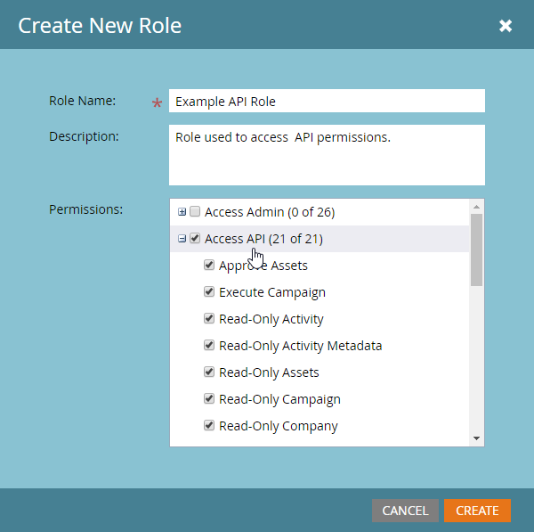
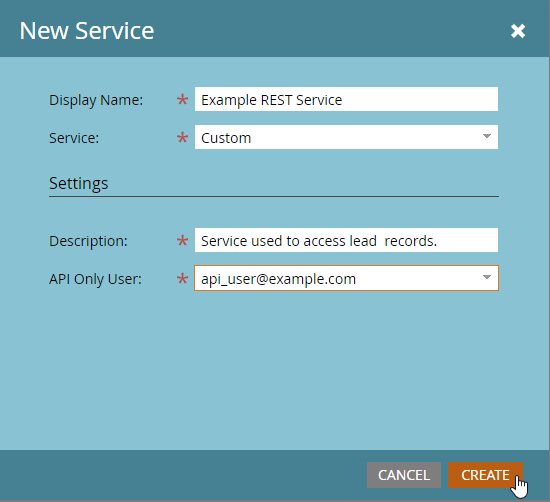
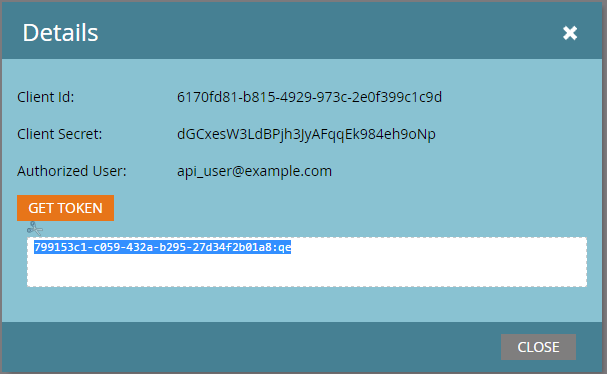

# Custom Services

A Custom Service provides credentials to authenticate with Marketo. Credentials are needed to obtain an access token from the Marketo [Identity service](https://developer.adobe.com/marketo-apis/api/identity/#tag/Identity/operation/identityUsingGET). Each Custom Service is scoped to a single API-Only user from which it derives its permissions.

## Roles

The first step in creating a Custom Service is to create a role that you can apply to the relevant API-Only user. This is done from the **Admin** > **Users & Roles** > **Roles** menu.

Roles are containers for individual permissions which permit or restrict access to certain functions. In subscriptions which have Workspaces and Partitions enabled, permissions are awarded on a per workspace basis. If a user has a permission in one workspace but not another, then they will only be able to perform permitted actions in that workspace. To create a role, select **New Role**.

Be sure to give your role a descriptive name. API-Only users have a specific set of permissions which are separate and distinct from normal user permissions. API permissions exist in their own hierarchy underneath the "Access API" tree.

### Role Permissions

Only permissions in the "Access API" group are applied to API users, that is, awarding all admin permissions will not grant any API Permissions to a user.

When constructing a role, think carefully about what actions you should permit the application using it to do. Award only the minimal set of permissions required to carry out those actions. Allowing an unnecessarily permissive set of permissions can allow integrations to perform unwanted actions in your subscription. You can use the [permissions tool](endpoint-reference.md) to determine your minimal set of permissions. See the full list of [permissions](#permission_list).

## Users

After creating a role, you must create an 'API-Only' user. API-Only users are a special type of user in Marketo, as they are administrated by other users and cannot be used to log in to Marketo. API-Only users may:

- Create Custom Services
- Scope permissions for those services
- Access REST APIs

Give your user a descriptive name and email address (it does not must be valid), based on the service and application that it will be used for. Fill in the required fields in the dialog menu, select the **API Only** checkbox, and award one of your API roles to the user. This assigns that role's permissions set to the user.

Finally, select **Send** to create the API-Only user.

When provisioning a new application with credentials, strongly consider making a new user for the service even if it has the same permission set as another existing integration. API call usage statistics and errors are tracked on a per user basis, so provisioning a user for each application can help you isolate usage and issues to specific applications. This comes in handy if you encounter issues with hitting your daily API call limits, or errors resulting from API calls made by integrations.

## Custom Services

Custom Services provide the actual credentials, the Client Id and the Client Secret, required to perform Authentication with a Marketo instance. To provision one, go to your **Admin** > **Integrations** > **LaunchPoint** menu, and select **New Service**.

Give your service a descriptive name and from the "Service" list select the "Custom". Give your service a verbose description and select an appropriate user from the API Only User list, then select **Create**.

This adds a new service to your list of LaunchPoint services, and the option to "View Details". Click "View Details" and you are given the Client Id and Client Secret required for authentication, the owning user, and an option to Get Token for short-term testing purposes. The token you get from this dialog has the same lifetime as tokens obtained normally from the [Identity service](https://developer.adobe.com/marketo-apis/api/identity/#tag/Identity/operation/identityUsingGET) and is valid for 3,600 seconds from creation.

## Workspaces and Partitions

In subscriptions with Workspaces and Partitions, the ability to access a given record or asset is granted based on the permissions which a user's role has in a given workspace. Each workspace is given access to one or more partitions in the Workspaces and Partitions menu, and a lead belongs to a single partition. If the API-only user has access to read or write lead records in a workspace, then it is able to access all records in partitions which that workspace has access to.

Assets belong to workspaces, so the ability to read or write an asset is determined by whether the user has a role in the relevant workspace which has permission to read or write that type of asset record in the workspace.

## Permission List

The following is a list of all permissions available to API-Only users and what they permit a user with that permission to do.

| Role Permission | Grants Access to... |
| --- | --- |
| Approve Assets | Approve assets |
| Execute Campaign | Request or Schedule a campaign |
| Read-Only Activity | Retrieve lead activities |
| Read-Only Activity Metadata | Retrieve lead activity metadata |
| Read-Only Assets | Retrieve asset details |
| Read-Only Campaign | Retrieve campaign details |
| Read-Only Company | Retrieve company details |
| Read-Only Custom Object | Retrieve custom object details |
| Read-Only Lead | Retrieve lead details |
| Read-Only Named Account | Retrieve named account details |
| Read-Only Named Account List | Retrieve named account list details |
| Read-Only Opportunity | Retrieve opportunity details |
| Read-Only Sales Person | Retrieve sales person details |
| Read-Write Activity | Retrieve and create lead activities |
| Read-Write Activity Metadata | Retrieve and create lead activity metadata |
| Read-Write Assets | Retrieve, create, and update assets |
| Read-Write Campaign | Retrieve, create, and update campaigns |
| Read-Write Company | Retrieve, create, and update companies |
| Read-Write Custom Object | Retrieve, create, and update custom objects |
| Read-Write Lead | Retrieve, create, and update lead details |
| Read-Write Named Account | Retrieve, create, and update named accounts |
| Read-Write Named Account List | Retrieve, create, and update named account lists |
| Read-Write Opportunity | Retrieve, create, and update opportunities |
| Read-Write Sales Person | Retrieve, create, and update sales persons |
