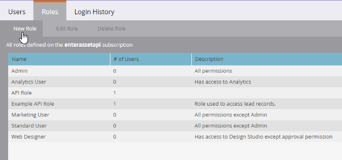
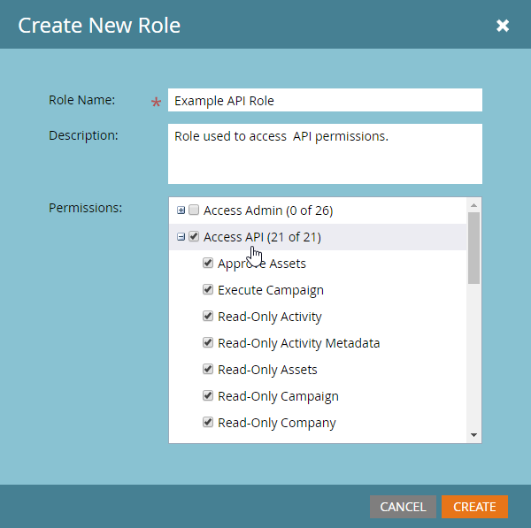
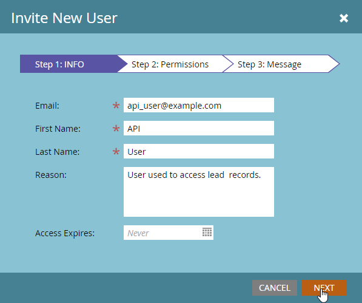
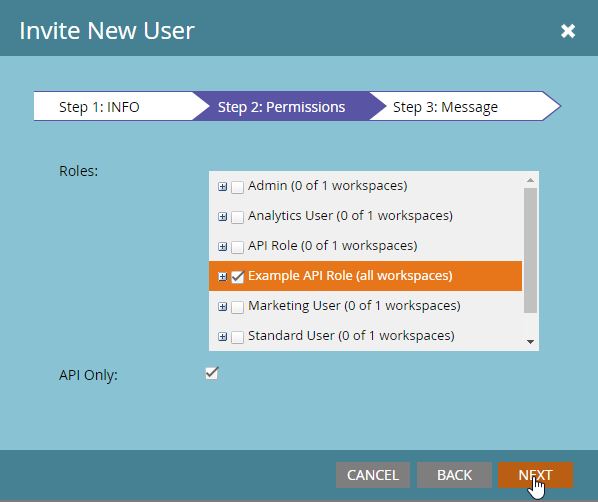
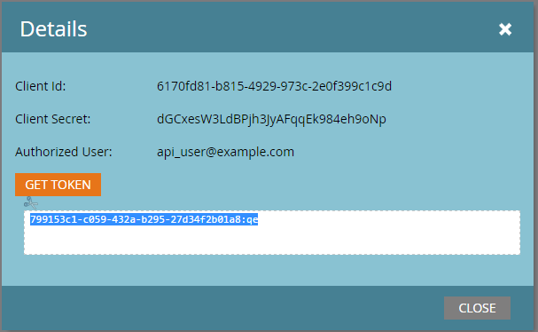

# Custom Services

A Custom Service provides the credentials used to authenticate with Marketo and obtain an access token from the Marketo [Identity service](https://developer.adobe.com/marketo-apis/api/identity#operation/identityUsingGET). Each Custom Service is scoped to one API-Only user and derives its permissions from that user.

## Roles

Before you create a Custom Service, create a role to assign to the relevant API-Only user. Go to **Admin** > **Users & Roles** > **Roles**.

Roles contain individual permissions that allow or restrict access to specific functions. In subscriptions with Workspaces and Partitions enabled, permissions are assigned per workspace. A user can perform permitted actions only in the workspaces where the user has those permissions.

To create a role, select **New Role**.

Give the role a descriptive name. API-Only users have a specific set of permissions that are separate from standard user permissions. API permissions appear in their own hierarchy under the "Access API" tree.

### Role Permissions

Only permissions in the "Access API" group apply to API users. Assigning all admin permissions does not grant API permissions to a user.

When you construct a role, identify the actions that the application must perform. Assign only the minimum permissions required for those actions. Unnecessary permissions can allow integrations to perform unwanted actions in your subscription.

Use the [permissions tool](endpoint-reference.md) to determine the minimum set of permissions. See the full list of [permissions](#permission_list).

## Users

After creating a role, create an 'API-Only' user. Other users administer API-Only users, and API-Only users cannot log in to Marketo. They can:

- Create Custom Services
- Scope permissions for those services
- Access REST APIs

Give the user a descriptive name and an email address based on the service and application that will use the account. The email address does not need to be valid. Complete the required fields, select the **API Only** checkbox, and assign one of your API roles to the user. This action assigns the role's permission set to the user.

Select **Send** to create the API-Only user.

When you provision credentials for a new application, consider creating a separate user for the service, even if another integration uses the same permission set. API call usage statistics and errors are tracked per user.

A user for each application helps isolate usage and issues to specific applications. This separation is useful when integrations reach daily API call limits or generate API errors.

## Custom Services

Custom Services provide the Client Id and Client Secret required to authenticate with a Marketo instance. To provision a service, go to **Admin** > **Integrations** > **LaunchPoint**, and select **New Service**.

Give the service a descriptive name. From the "Service" list, select "Custom". Enter a detailed description, select an appropriate user from the API Only User list, and then select **Create**.

The service appears in the list of LaunchPoint services with a "View Details" option. Select "View Details" to access the Client Id, Client Secret, owning user, and Get Token option.

Use Get Token for short-term testing. The token has the same lifetime as tokens obtained from the [Identity service](https://developer.adobe.com/marketo-apis/api/identity#operation/identityUsingGET) and is valid for 3,600 seconds after creation.

## Workspaces and Partitions

In subscriptions with Workspaces and Partitions, a user's role permissions in a workspace determine access to records and assets. Each workspace has access to one or more partitions, and each lead belongs to one partition.

If an API-Only user can read or write lead records in a workspace, the user can access all records in the partitions available to that workspace.

Assets belong to workspaces. A user can read or write an asset when the user has a role with the required permission in the asset's workspace.

## Permission List

The following table lists the permissions available to API-Only users and the access that each permission grants.

| Role Permission | Grants Access to... |
| --- | --- |
| Approve Assets | Approve assets |
| Execute Campaign | Request or Schedule a campaign |
| Read-Only Activity | Retrieve lead activities |
| Read-Only Activity Metadata | Retrieve lead activity metadata |
| Read-Only Assets | Retrieve asset details |
| Read-Only Campaign | Retrieve campaign details |
| Read-Only Company | Retrieve company details |
| Read-Only Custom Object | Retrieve custom object details |
| Read-Only Lead | Retrieve lead details |
| Read-Only Named Account | Retrieve named account details |
| Read-Only Named Account List | Retrieve named account list details |
| Read-Only Opportunity | Retrieve opportunity details |
| Read-Only Sales Person | Retrieve sales person details |
| Read-Write Activity | Retrieve and create lead activities |
| Read-Write Activity Metadata | Retrieve and create lead activity metadata |
| Read-Write Assets | Retrieve, create, and update assets |
| Read-Write Campaign | Retrieve, create, and update campaigns |
| Read-Write Company | Retrieve, create, and update companies |
| Read-Write Custom Object | Retrieve, create, and update custom objects |
| Read-Write Lead | Retrieve, create, and update lead details |
| Read-Write Named Account | Retrieve, create, and update named accounts |
| Read-Write Named Account List | Retrieve, create, and update named account lists |
| Read-Write Opportunity | Retrieve, create, and update opportunities |
| Read-Write Sales Person | Retrieve, create, and update sales persons |
