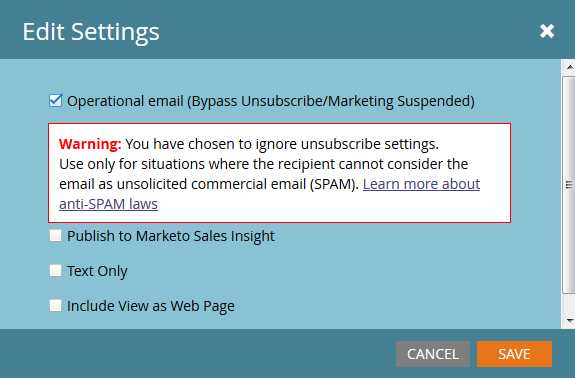
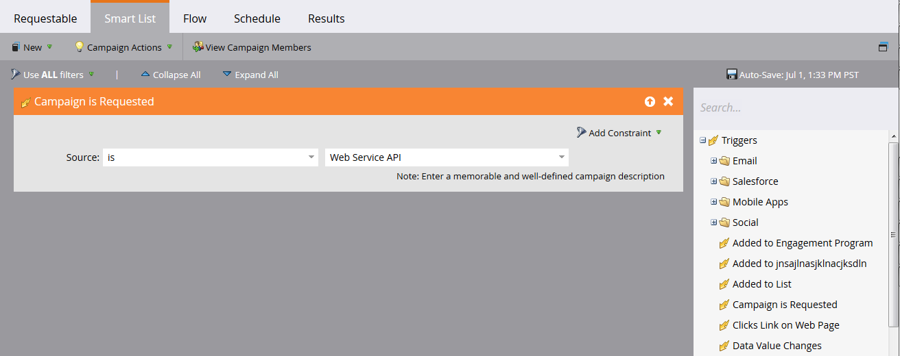
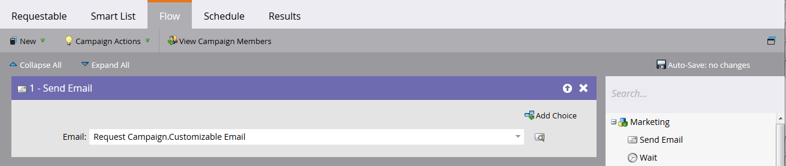
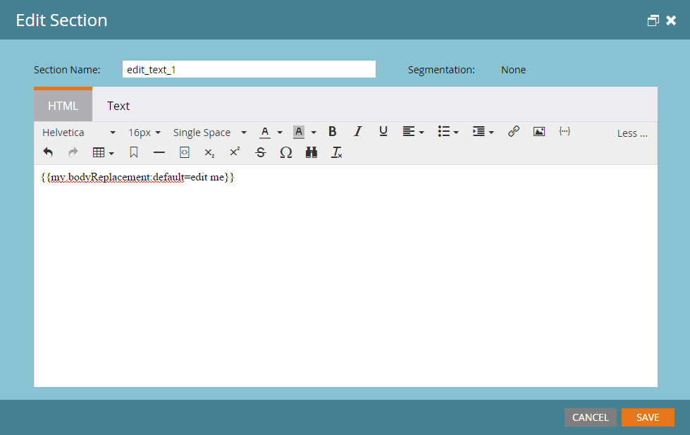

# Transactional Email

Use the [Request Campaign](https://developer.adobe.com/marketo-apis/api/mapi#operation/triggerCampaignUsingPOST) API to send transactional emails to specific Marketo records. Configure the email and trigger campaign before making the request.

- Ensure that the recipient has a Marketo record.
- Create and approve a transactional email in the Marketo instance.
- Activate a trigger campaign that uses "Campaign is Requested, 1. Source: Web Service API" and sends the email.

First, [create and approve the email](https://experienceleague.adobe.com/docs/marketo/using/home.html). If the email legally qualifies as operational, configure it as operational under Email Actions > Email Settings:




Approve the email before creating the campaign:


If needed, see [Create a new Smart Campaign](https://experienceleague.adobe.com/docs/marketo/using/product-docs/core-marketo-concepts/smart-campaigns/creating-a-smart-campaign/create-a-new-smart-campaign.html). Configure the campaign's Smart List with the Campaign is Requested trigger:



Configure a Send Email flow step that references the transactional email:



Before activation, configure the qualification settings on the Schedule tab. Keep the default setting if each record should receive the email only once. Otherwise, allow recipients to qualify every time or at an available cadence.

Activate the campaign:


## Sending the API Calls

The Java examples use the [minimal-json package](https://github.com/ralfstx/minimal-json) to handle JSON representations.

Before sending the email, confirm that a Marketo record exists for the email address and retrieve its lead ID. This example assumes that the email address already exists.

Use [Get Leads by Filter Type](https://developer.adobe.com/marketo-apis/api/mapi#operation/getLeadsByFilterUsingGET) to retrieve the ID. The following main method then requests the campaign:

```java
package dev.marketo.blog_request_campaign;

import com.eclipsesource.json.JsonArray;

public class App
{
    public static void main( String[] args )
    {
        //Create an instance of Auth so that we can authenticate with our Marketo instance
        Leads leadsRequest = new Leads(auth).setFilterType("email").addFilterValue("requestCampaign.test@marketo.com");

        //Create and parameterize an instance of Leads
        //Set your email filterValue appropriately
        Leads leadsRequest = new Leads(auth).setFilterType("email").addFilterValue("test.requestCamapign@example.com");

        //Get the inner results array of the response
        JsonArray leadsResult = leadsRequest.getData().get("result").asArray();

        //Get the id of the record indexed at 0
        int lead = leadsResult.get(0).asObject().get("id").asInt();

        //Set the ID of your campaign from Marketo
        int campaignId = 0;
        RequestCampaign rc = new RequestCampaign(auth, campaignId).addLead(lead);

        //Send the request to Marketo
        rc.postData();
    }
}
```

Extract the result array from the `JsonObject` response and retrieve the object at index 0:

```java
JsonArray leadsResult = leadsRequest.getData().get("result").asArray();
int leadId = leadsResult.get(0).asObject().get("id").asInt();
```

Call Request Campaign with the campaign ID in the request URL. The request body contains an array of JSON objects with an `id` member:

```java
package dev.marketo.blog_request_campaign;
import java.io.IOException;
import java.io.InputStream;
import java.io.InputStreamReader;
import java.io.OutputStreamWriter;
import java.io.Reader;
import java.net.MalformedURLException;
import java.net.URL;
import java.util.ArrayList;
import javax.net.ssl.HttpsURLConnection;
import com.eclipsesource.json.JsonArray;
import com.eclipsesource.json.JsonObject;

public class RequestCampaign {
    private String endpoint;
    private Auth auth;
    public ArrayList leads = new ArrayList();
    public ArrayList tokens = new ArrayList();

    public RequestCampaign(Auth auth, int campaignId) {
        this.auth = auth;
        this.endpoint = this.auth.marketoInstance + "/rest/v1/campaigns/" + campaignId + "/trigger.json";
    }
    public RequestCampaign setLeads(ArrayList leads) {
        this.leads = leads;
        return this;
    }
    public RequestCampaign addLead(int lead){
        leads.add(lead);
        return this;
    }
    public RequestCampaign setTokens(ArrayList tokens) {
        this.tokens = tokens;
        return this;
    }
    public RequestCampaign addToken(String tokenKey, String val){
        JsonObject jo = new JsonObject().add("name", tokenKey);
        jo.add("value", val);
        tokens.add(jo);
        return this;
    }
    public JsonObject postData(){
        JsonObject result = null;
        try {
            JsonObject requestBody = buildRequest(); //builds the Json Request Body
            System.out.println("Executing RequestCampaign call\n" + "Endpoint: " + endpoint + "\nRequest Body:\n"  + requestBody);
            URL url = new URL(endpoint);
            HttpsURLConnection urlConn = (HttpsURLConnection) url.openConnection(); //Return a URL connection and cast to HttpsURLConnection
            urlConn.setRequestMethod("POST");
            urlConn.setRequestProperty("Content-type", "application/json");
            urlConn.setRequestProperty("accept", "text/json");
            urlConn.setDoOutput(true);
            OutputStreamWriter wr = new OutputStreamWriter(urlConn.getOutputStream());
            wr.write(requestBody.toString());
            wr.flush();
            InputStream inStream = urlConn.getInputStream(); //get the inputStream from the URL connection
            Reader reader = new InputStreamReader(inStream);
            result = JsonObject.readFrom(reader); //Read from the stream into a JsonObject
            System.out.println("Result:\n" + result);
        } catch (MalformedURLException e) {
            e.printStackTrace();
        } catch (IOException e) {
            e.printStackTrace();
        }
        return result;
    }

    private JsonObject buildRequest(){
        JsonObject requestBody = new JsonObject(); //Create a new JsonObject for the Request Body
        JsonObject input = new JsonObject();
        JsonArray leadsArray = new JsonArray();
        for (int lead : leads) {
            JsonObject jo = new JsonObject().add("id", lead);
            leadsArray.add(jo);
        }
        input.add("leads", leadsArray);
        JsonArray tokensArray = new JsonArray();
        for (JsonObject jo : tokens) {
            tokensArray.add(jo);
        }
        input.add("tokens", tokensArray);
        requestBody.add("input", input);
        return requestBody;
    }

}
```

This class has one constructor taking an Auth, and the Id of the campaign. Leads are added to the object either by passing an `ArrayListInteger` containing the Ids of the records to setLeads, or by using addLead, which takes one integer and appends it to the existing ArrayList in the leads property. To trigger the API call to pass the lead records to the campaign, postData must be called, which returns a JsonObject containing the response data from the request. When request campaign is called, every lead passed to the call will be processed by the target trigger campaign in Marketo and be sent the email which was created previously. Congratulations, you have triggered an email through the Marketo REST API. Keep an eye out for Part 2 where we look at dynamically customizing the content of an email through Request Campaign.

### Building your Email

To customize our content, first we must configure a [program](https://experienceleague.adobe.com/docs/marketo/using/product-docs/core-marketo-concepts/programs/creating-programs/create-a-program.html) and an [email](https://experienceleague.adobe.com/docs/marketo/using/home.html) in Marketo. To generate our custom content, we must create tokens inside the program, and then place them into the email that we are going to be sending. For simplicity's sake, we are using just one token in this example, but you can replace any number of tokens in an email, in the From Email, From Name, Reply-to, or any piece of content in the email. So let's create one token Rich Text for replacement and call it "bodyReplacement". Rich Text allows us to replace any content in the token with arbitrary HTML that we want to input.


Tokens cannot be saved while empty, so go ahead and insert some placeholder text here. Now we must insert our token into the email:



This token will now be accessible for replacement through a Request Campaign call. This token can be as simple as a single line of text which must be replaced on a per-email basis, or can include almost the entire layout of the email.

### The Code

```java
package dev.marketo.blog_request_campaign;

import com.eclipsesource.json.JsonArray;

public class App
{
    public static void main( String[] args )
    {
        //Create an instance of Auth so that we can authenticate with our Marketo instance
        Auth auth = new Auth("Client ID - CHANGE ME", "Client Secret - CHANGE ME", "Host - CHANGE ME");

        //Create and parameterize an instance of Leads
        Leads leadsRequest = new Leads(auth).setFilterType("email").addFilterValue("requestCampaign.test@marketo.com");

        //get the inner results array of the response
        JsonArray leadsResult = leadsRequest.getData().get("result").asArray();

        //get the id of the record indexed at 0
        int lead = leadsResult.get(0).asObject().get("id").asInt();

        //Set the ID of our campaign from Marketo
        int campaignId = 1578;
        RequestCampaign rc = new RequestCampaign(auth, campaignId).addLead(lead);

        //Create the content of the token here, and add it to the request
        String bodyReplacement = "<div class=\"replacedContent\"><p>This content has been replaced</p></div>";
        rc.addToken("{{my.bodyReplacement}}", bodyReplacement);
        rc.postData();
    }
}
```

If the code looks familiar, that is because it only has two additional lines from the main method above. This time we are creating the content of our token in the bodyReplacement variable and then using the addToken method to add it to the request. addToken takes a key and a value and then creates a JsonObject representation and adds it to the internal tokens array. This is then serialized during the postData method and creates a body that looks like this:

```json
{
    "input":
    {
        "leads": [
            {
                "id": 1
            }
        ],
        "tokens": [
            {
                "name": "{{my.bodyReplacement}}",
                "value": "<div class=\"replacedContent\"><p>This content has been replaced</p></div>"
            }
        ]
    }
}
```

Combined, our console output looks like this:

```bash
Token is empty or expired. Trying new authentication
Trying to authenticate with ...
Got Authentication Response: {"access_token":"19d51b9a-ff60-4222-bbd5-be8b206f1d40:st","token_type":"bearer","expires_in":3565,"scope":"apiuser@mktosupport.com"}
Executing RequestCampaign call
Endpoint: .../rest/v1/campaigns/1578/trigger.json
Request Body:
{"input":{"leads":[{"id":1}],"tokens":[{"name":"{{my.bodyReplacement}}","value":"<div class=\"replacedContent\"><p>This content has been replaced</p></div>"}]}}
Result:
{"requestId":"1e8d#14eadc5143d","result":[{"id":1578}],"success":true}
```

## Wrapping Up

This method is extensible in a multitude of ways, changing content in emails within individual layout sections, or outside emails, allowing custom values to be passed into tasks or interesting moments. Anywhere a token can be used from within a program can be customized using this method. Similar functionality is also available with the [Schedule Campaign](https://developer.adobe.com/marketo-apis/api/mapi#operation/scheduleCampaignUsingPOST) call which will allow you to process tokens across an entire batch campaign. These cannot be customized on a per lead basis, but are useful for customizing content across a wide set of leads.
