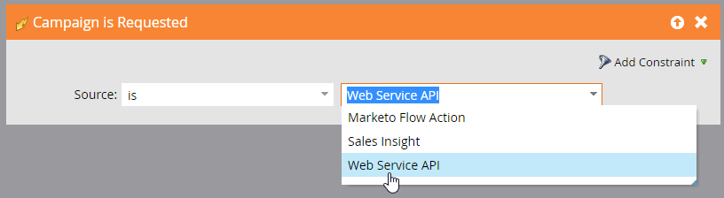

<InlineAlert slots="text" variant="warning" />

The SOAP API is deprecated and will reach end of life on July 31, 2026. All new integrations should be developed using the [Marketo REST API](../rest-api/rest-api.md), and existing integrations should be migrated before that date.

# getCampaignsForSource

This function returns a list of eligible Marketo campaigns that can be used as input parameters into the requestCampaign function. Campaigns are categorized by the source of the request, which is counted in the WSDL.

Important: The Smart Campaign must have a "Campaign is Requested" trigger to qualify. Its source must include Web Service API.



## Request

| Field Name | Required/Optional | Description |
| --- | --- | --- |
| source | Required | source can be `MKTOWS` or `SALES`. The latter provides a list of campaigns available to Sales Insight. |
| name | Optional | use this to filter by name. This is a single string, not an array of strings. |
| exactName | Optional | Boolean value to indicate if you want an exact match for the name parameter |

## Request XML

```xml
<?xml version="1.0" encoding="UTF-8"?>
<SOAP-ENV:Envelope xmlns:SOAP-ENV="http://schemas.xmlsoap.org/soap/envelope/" xmlns:ns1="http://www.marketo.com/mktows/">
  <SOAP-ENV:Header>
    <ns1:AuthenticationHeader>
      <mktowsUserId>demo17_1_809934544BFABAE58E5D27</mktowsUserId>
      <requestSignature>d4bebb327d734bc517851f4b93d488cf4498be81</requestSignature>
      <requestTimestamp>2013-08-05T11:08:02-07:00</requestTimestamp>
    </ns1:AuthenticationHeader>
  </SOAP-ENV:Header>
  <SOAP-ENV:Body>
    <ns1:paramsGetCampaignsForSource>
      <source>MKTOWS</source>
      <name>Trigger</name>
      <exactName>false</exactName>
    </ns1:paramsGetCampaignsForSource>
  </SOAP-ENV:Body>
</SOAP-ENV:Envelope>
```

## Response XML

```xml
<?xml version="1.0" encoding="UTF-8"?>
<SOAP-ENV:Envelope xmlns:SOAP-ENV="http://schemas.xmlsoap.org/soap/envelope/" xmlns:ns1="http://www.marketo.com/mktows/">
  <SOAP-ENV:Body>
    <ns1:successGetCampaignsForSource>
      <result>
        <returnCount>13</returnCount>
        <campaignRecordList>
          <campaignRecord>
            <id>3374</id>
            <name>ER Demo.Triggered Campaign</name>
            <description />
          </campaignRecord>
          <campaignRecord>
            <id>4240</id>
            <name>Fulfillment Email Trigger for Social App:</name>
            <description />
          </campaignRecord>
          <campaignRecord>
            <id>4038</id>
            <name>Fulfillment Email Trigger for Social App: 398</name>
            <description />
          </campaignRecord>
          <campaignRecord>
            <id>4040</id>
            <name>Fulfillment Email Trigger for Social App: 400</name>
            <description />
          </campaignRecord>
          <campaignRecord>
            <id>4242</id>
            <name>Fulfillment Email Trigger for Social App: 442</name>
            <description />
          </campaignRecord>
          <campaignRecord>
            <id>4335</id>
            <name>Fulfillment Email Trigger for Social App: 442</name>
            <description />
          </campaignRecord>
          <campaignRecord>
            <id>4477</id>
            <name>Fulfillment Email Trigger for Social App: 465</name>
            <description />
          </campaignRecord>
          <campaignRecord>
            <id>4239</id>
            <name>Sign-Up Email Trigger for Social App:</name>
            <description />
          </campaignRecord>
          <campaignRecord>
            <id>4037</id>
            <name>Sign-Up Email Trigger for Social App: 398</name>
            <description />
          </campaignRecord>
          <campaignRecord>
            <id>4039</id>
            <name>Sign-Up Email Trigger for Social App: 400</name>
            <description />
          </campaignRecord>
          <campaignRecord>
            <id>4241</id>
            <name>Sign-Up Email Trigger for Social App: 442</name>
            <description />
          </campaignRecord>
          <campaignRecord>
            <id>4334</id>
            <name>Sign-Up Email Trigger for Social App: 442</name>
            <description />
          </campaignRecord>
          <campaignRecord>
            <id>4476</id>
            <name>Sign-Up Email Trigger for Social App: 465</name>
            <description />
          </campaignRecord>
        </campaignRecordList>
      </result>
    </ns1:successGetCampaignsForSource>
  </SOAP-ENV:Body>
</SOAP-ENV:Envelope>
```

## Sample Code - PHP

```php
 <?php
$debug = true;
$marketoSoapEndPoint    = "";  // CHANGE ME
$marketoUserId      = "";  // CHANGE ME
$marketoSecretKey   = "";  // CHANGE ME
$marketoNameSpace   = "http://www.marketo.com/mktows/";

// Create Signature
$dtzObj = new DateTimeZone("America/Los_Angeles");
$dtObj  = new DateTime('now', $dtzObj);
$timeStamp = $dtObj->format(DATE_W3C);
$encryptString = $timeStamp . $marketoUserId;
$signature = hash_hmac('sha1', $encryptString, $marketoSecretKey);

// Create SOAP Header
$attrs = new stdClass();
$attrs->mktowsUserId = $marketoUserId;
$attrs->requestSignature = $signature;
$attrs->requestTimestamp = $timeStamp;
$authHdr = new SoapHeader($marketoNameSpace, 'AuthenticationHeader', $attrs);
$options = array("connection_timeout" => 15, "location" => $marketoSoapEndPoint);
if ($debug) {
  $options["trace"] = 1;
}
// Create Request
$params = new stdClass();
$params->source = "MKTOWS";
$params->name="Trigger";
$params->exactName=false;

$soapClient = new SoapClient($marketoSoapEndPoint ."?WSDL", $options);
try {
  $leads = $soapClient->__soapCall('getCampaignsForSource', array($params), $options, $authHdr);
  //      print_r($leads);
}
catch(Exception $ex) {
  var_dump($ex);
}
if ($debug) {
  print "RAW request:\n" .$soapClient->__getLastRequest() ."\n";
  print "RAW response:\n" .$soapClient->__getLastResponse() ."\n";
}
?>
```

## Sample Code - Java

```java
import com.marketo.mktows.*;
import java.net.URL;
import javax.xml.namespace.QName;
import java.text.DateFormat;
import java.text.SimpleDateFormat;
import java.util.Date;
import javax.crypto.Mac;
import javax.crypto.spec.SecretKeySpec;
import org.apache.commons.codec.binary.Hex;
import javax.xml.bind.JAXBContext;
import javax.xml.bind.JAXBElement;
import javax.xml.bind.Marshaller;

public class GetCampaignsForSource {

    public static void main(String[] args) {
        System.out.println("Executing Get Campaigns For Source");
        try {
            URL marketoSoapEndPoint = new URL("CHANGE ME" + "?WSDL");
            String marketoUserId = "CHANGE ME";
            String marketoSecretKey = "CHANGE ME";

            QName serviceName = new QName("http://www.marketo.com/mktows/", "MktMktowsApiService");
            MktMktowsApiService service = new MktMktowsApiService(marketoSoapEndPoint, serviceName);
            MktowsPort port = service.getMktowsApiSoapPort();

            // Create Signature
            DateFormat df = new SimpleDateFormat("yyyy-MM-dd'T'HH:mm:ssZ");
            String text = df.format(new Date());
            String requestTimestamp = text.substring(0, 22) + ":" + text.substring(22);
            String encryptString = requestTimestamp + marketoUserId ;

            SecretKeySpec secretKey = new SecretKeySpec(marketoSecretKey.getBytes(), "HmacSHA1");
            Mac mac = Mac.getInstance("HmacSHA1");
            mac.init(secretKey);
            byte[] rawHmac = mac.doFinal(encryptString.getBytes());
            char[] hexChars = Hex.encodeHex(rawHmac);
            String signature = new String(hexChars);

            // Set Authentication Header
            AuthenticationHeader header = new AuthenticationHeader();
            header.setMktowsUserId(marketoUserId);
            header.setRequestTimestamp(requestTimestamp);
            header.setRequestSignature(signature);

            // Create Request
            ParamsGetCampaignsForSource request = new ParamsGetCampaignsForSource();

            request.setSource(ReqCampSourceType.MKTOWS);

            ObjectFactory objectFactory = new ObjectFactory();
            JAXBElement<String> name = objectFactory.createParamsGetCampaignsForSourceName("Trigger");
            request.setName(name);

            JAXBElement<Boolean> exactName = objectFactory.createParamsGetCampaignsForSourceExactName(false);
            request.setExactName(exactName);

            SuccessGetCampaignsForSource result = port.getCampaignsForSource(request, header);

            JAXBContext context = JAXBContext.newInstance(SuccessGetCampaignsForSource.class);
            Marshaller m = context.createMarshaller();
            m.setProperty(Marshaller.JAXB_FORMATTED_OUTPUT, true);
            m.marshal(result, System.out);

        }
        catch(Exception e) {
            e.printStackTrace();
        }
    }
}
```

## Sample Code - Ruby

```ruby
require 'savon' # Use version 2.0 Savon gem
require 'date'

mktowsUserId = "" # CHANGE ME
marketoSecretKey = "" # CHANGE ME
marketoSoapEndPoint = "" # CHANGE ME
marketoNameSpace = "http://www.marketo.com/mktows/"

#Create Signature
Timestamp = DateTime.now
requestTimestamp = Timestamp.to_s
encryptString = requestTimestamp + mktowsUserId
digest = OpenSSL::Digest.new('sha1')
hashedsignature = OpenSSL::HMAC.hexdigest(digest, marketoSecretKey, encryptString)
requestSignature = hashedsignature.to_s

#Create SOAP Header
headers = {
    'ns1:AuthenticationHeader' => { "mktowsUserId" => mktowsUserId, "requestSignature" => requestSignature,
    "requestTimestamp"  => requestTimestamp
    }
}

client = Savon.client(wsdl: 'http://app.marketo.com/soap/mktows/2_3?WSDL', soap_header: headers, endpoint: marketoSoapEndPoint, open_timeout: 90, read_timeout: 90, namespace_identifier: :ns1, env_namespace: 'SOAP-ENV')

#Create Request
request = {
    :source => "MKTOWS",
    :name => "Trigger",
    :exact_name => "false"
}

response = client.call(:get_campaigns_for_source, message: request)

puts response
```
