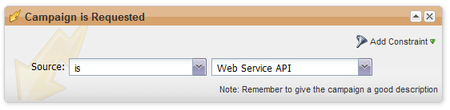

<InlineAlert slots="text" variant="warning" />

The SOAP API is deprecated and will reach end of life on July 31, 2026. All new integrations should be developed using the [Marketo REST API](../rest-api/rest-api.md), and existing integrations should be migrated before that date.

# requestCampaign

This function runs an existing Marketo lead in a Marketo Smart Campaign. The Smart Campaign must have a "Campaign is Requested" trigger with Web Service API source (see below).



There are two parameter sets that can be used. The first case is using `campaignName` + `programName` + `programTokenList`. The `programTokenList` can be empty in this case. The second case is using `campaignId` alone. Any other combination throws a bad parameter exception.

Note: Limit of 100 leadKey values per call. Additional keys are ignored.

| Field Name | Required/Optional | Description |
| --- | --- | --- |
| leadList->leadKey->keyType | Required | `keyType` allows you to specify the field you wish to query the lead by. Possible values include:`IDNUM`, `EMAIL`, `SFDCLEADID`, `LEADOWNEREMAIL`, `SFDCACCOUNTID`, `SFDCCONTACTID`, `SFDCLEADID`, `SFDCLEADOWNERID`, `SFDCOPPTYID` |
| leadList->leadKey->keyValue | Required | `keyValue` is the value that you wish to query the lead by. |
| source | Required | The campaign source. Possible values: `MKTOWS` or `SALES`. Enumeration is defined in WSDL. |
| campaignId | Optional when `campaignName`, `programName`, and `programTokenList` are together in a parameter site; Otherwise `campaignId` is required | The ID of the campaign. NOTE: A bad parameter error occurs if `campaignID` and `campaignName` are both passed. |
| campaignName | Optional when campaignId is present; Otherwise required in a set as `campaignName`, programName, and programTokenList | The name of the campaign |
| programName | Optional when campaignId is present; Otherwise required in a set as `campaignName`, programName, and programTokenList | The name of the program |
| programTokenList | Optional when campaignId is present; Otherwise required in a set as `campaignName`, `programName`, and `programTokenList` | Array of tokens to be used in the campaign. When specifying tokens, programName and `campaignName` are required. |
| programTokenList->attrib->name | Optional | The name of the program token you wish to pass the value of. Ex: `{{my.message}}` |
| programTokenList->attrib->value | Optional | The value for the specified token name. |

## Request XML

```xml
<?xml version="1.0" encoding="UTF-8"?>
<SOAP-ENV:Envelope xmlns:SOAP-ENV="http://schemas.xmlsoap.org/soap/envelope/" xmlns:ns1="http://www.marketo.com/mktows/">
  <SOAP-ENV:Header>
    <ns1:AuthenticationHeader>
      <mktowsUserId>demo17_1_809939944BFABAE58E5D27</mktowsUserId>
      <requestSignature>48397ad47b71a1439f13a51eea3137df46441979</requestSignature>
      <requestTimestamp>2013-08-01T12:31:14-07:00</requestTimestamp>
    </ns1:AuthenticationHeader>
  </SOAP-ENV:Header>
  <SOAP-ENV:Body>
    <ns1:paramsRequestCampaign>
      <source>MKTOWS</source>
      <campaignId>4496</campaignId>
      <leadList>
        <leadKey>
          <keyType>EMAIL</keyType>
          <keyValue>lead@company.com</keyValue>
        </leadKey>
        <leadKey>
          <keyType>EMAIL</keyType>
          <keyValue>anotherlead@company.com</keyValue>
        </leadKey>
      </leadList>
    </ns1:paramsRequestCampaign>
  </SOAP-ENV:Body>
</SOAP-ENV:Envelope>
```

## Response XML

```xml
<?xml version="1.0" encoding="UTF-8"?>
<SOAP-ENV:Envelope xmlns:SOAP-ENV="http://schemas.xmlsoap.org/soap/envelope/" xmlns:ns1="http://www.marketo.com/mktows/">
  <SOAP-ENV:Body>
    <ns1:successRequestCampaign>
      <result>
        <success>true</success>
      </result>
    </ns1:successRequestCampaign>
  </SOAP-ENV:Body>
</SOAP-ENV:Envelope>
```

## Sample Code - PHP

```php
 <?php

  $debug = true;

  $marketoSoapEndPoint     = "";  // CHANGE ME
  $marketoUserId           = "";  // CHANGE ME
  $marketoSecretKey        = "";  // CHANGE ME
  $marketoNameSpace        = "http://www.marketo.com/mktows/";

  // Create Signature
  $dtzObj = new DateTimeZone("America/Los_Angeles");
  $dtObj  = new DateTime('now', $dtzObj);
  $timeStamp = $dtObj->format(DATE_W3C);
  $encryptString = $timeStamp . $marketoUserId;
  $signature = hash_hmac('sha1', $encryptString, $marketoSecretKey);

  // Create SOAP Header
  $attrs = new stdClass();
  $attrs->mktowsUserId = $marketoUserId;
  $attrs->requestSignature = $signature;
  $attrs->requestTimestamp = $timeStamp;
  $authHdr = new SoapHeader($marketoNameSpace, 'AuthenticationHeader', $attrs);
  $options = array("connection_timeout" => 20, "location" => $marketoSoapEndPoint);
  if ($debug) {
    $options["trace"] = true;
  }

  // Create Request
  $leadKey = array("keyType" => "EMAIL", "keyValue" => "lead@company.com");
  $leadKey2 = array("keyType" => "EMAIL&qquot;, "keyValue" => "anotherlead@company.com");

  $leadList = new stdClass();
  $leadList->leadKey = array($leadKey, $leadKey2);

  $source = "MKTOWS";
  $campaignId = "4496";

  $paramsRequestCampaign = new stdClass();
  $paramsRequestCampaign->campaignId = $campaignId;
  $paramsRequestCampaign->source = $source;
  $paramsRequestCampaign->leadList = $leadList;

  $params = array("paramsRequestCampaign" => $paramsRequestCampaign);

  $soapClient = new SoapClient($marketoSoapEndPoint ."?WSDL", $options);
  try {
    $response = $soapClient->__soapCall('requestCampaign', $params, $options, $authHdr);
  }
  catch(Exception $ex) {
    var_dump($ex);
  }
  if ($debug) {
    print "RAW request:\n" .$soapClient->__getLastRequest() ."\n";
    print "RAW response:\n" .$soapClient->__getLastResponse() ."\n";
  }
  print_r($response);
?>
```

## Sample Code - Java

```java
import com.marketo.mktows.*;

import java.net.URL;
import javax.xml.namespace.QName;
import java.text.DateFormat;
import java.text.SimpleDateFormat;
import java.util.Date;
import javax.crypto.Mac;
import javax.crypto.spec.SecretKeySpec;
import org.apache.commons.codec.binary.Hex;
import javax.xml.bind.JAXBContext;
import javax.xml.bind.JAXBElement;
import javax.xml.bind.Marshaller;


public class RequestCampaign {

    public static void main(String[] args) {
        System.out.println("Executing Request Campaign");
        try {
            URL marketoSoapEndPoint = new URL("CHANGE ME" + "?WSDL");
            String marketoUserId = "CHANGE ME";
            String marketoSecretKey = "CHANGE ME";

            QName serviceName = new QName("http://www.marketo.com/mktows/", "MktMktowsApiService");
            MktMktowsApiService service = new MktMktowsApiService(marketoSoapEndPoint, serviceName);
            MktowsPort port = service.getMktowsApiSoapPort();

            // Create Signature
            DateFormat df = new SimpleDateFormat("yyyy-MM-dd'T'HH:mm:ssZ");
            String text = df.format(new Date());
            String requestTimestamp = text.substring(0, 22) + ":" + text.substring(22);
            String encryptString = requestTimestamp + marketoUserId ;

            SecretKeySpec secretKey = new SecretKeySpec(marketoSecretKey.getBytes(), "HmacSHA1");
            Mac mac = Mac.getInstance("HmacSHA1");
            mac.init(secretKey);
            byte[] rawHmac = mac.doFinal(encryptString.getBytes());
            char[] hexChars = Hex.encodeHex(rawHmac);
            String signature = new String(hexChars);

            // Set Authentication Header
            AuthenticationHeader header = new AuthenticationHeader();
            header.setMktowsUserId(marketoUserId);
            header.setRequestTimestamp(requestTimestamp);
            header.setRequestSignature(signature);

            // Create Request
            ParamsRequestCampaign request = new ParamsRequestCampaign();

            request.setSource(ReqCampSourceType.MKTOWS);

            ObjectFactory objectFactory = new ObjectFactory();
            JAXBElement<Integer> campaignId = objectFactory.createParamsRequestCampaignCampaignId(4496);
            request.setCampaignId(campaignId);

            ArrayOfLeadKey leadKeyList = new ArrayOfLeadKey();
            LeadKey key = new LeadKey();
            key.setKeyType(LeadKeyRef.EMAIL);
            key.setKeyValue("lead@company.com");

            LeadKey key2 = new LeadKey();
            key2.setKeyType(LeadKeyRef.EMAIL);
            key2.setKeyValue("anotherlead@company.com");

            leadKeyList.getLeadKeies().add(key);
            leadKeyList.getLeadKeies().add(key2);

            JAXBElement<ArrayOfLeadKey> arrayOfLeadKey = objectFactory.createParamsRequestCampaignLeadList(leadKeyList);
            request.setLeadList(arrayOfLeadKey);

            SuccessRequestCampaign result = port.requestCampaign(request, header);

            JAXBContext context = JAXBContext.newInstance(SuccessRequestCampaign.class);
            Marshaller m = context.createMarshaller();
            m.setProperty(Marshaller.JAXB_FORMATTED_OUTPUT, true);
            m.marshal(result, System.out);

        }
        catch(Exception e) {
            e.printStackTrace();
        }
    }
}
```

## Sample Code - Ruby

```ruby
require 'savon' # Use version 2.0 Savon gem
require 'date'

mktowsUserId = "" # CHANGE ME
marketoSecretKey = "" # CHANGE ME
marketoSoapEndPoint = "" # CHANGE ME
marketoNameSpace = "http://www.marketo.com/mktows/"

#Create Signature
Timestamp = DateTime.now
requestTimestamp = Timestamp.to_s
encryptString = requestTimestamp + mktowsUserId
digest = OpenSSL::Digest.new('sha1')
hashedsignature = OpenSSL::HMAC.hexdigest(digest, marketoSecretKey, encryptString)
requestSignature = hashedsignature.to_s

#Create SOAP Header
headers = {
    'ns1:AuthenticationHeader' => { "mktowsUserId" => mktowsUserId, "requestSignature" => requestSignature,
    "requestTimestamp"  => requestTimestamp
    }
}

client = Savon.client(wsdl: 'http://app.marketo.com/soap/mktows/2_3?WSDL', soap_header: headers, endpoint: marketoSoapEndPoint, open_timeout: 90, read_timeout: 90, namespace_identifier: :ns1, env_namespace: 'SOAP-ENV')

#Create Request
request = {
    :source => "MKTOWS",
    :campaign_id => "4496",
    :lead_list => {
        :lead_key => {
            :key_type => "EMAIL",
            :key_value => "lead@company.com" },
        :lead_key! => {
            :key_type => "EMAIL",
            :key_value => "anotherlead@company.com" }
    }
}

response = client.call(:request_campaign, message: request)

puts response
```
