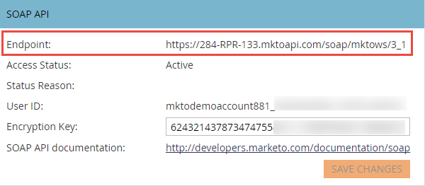
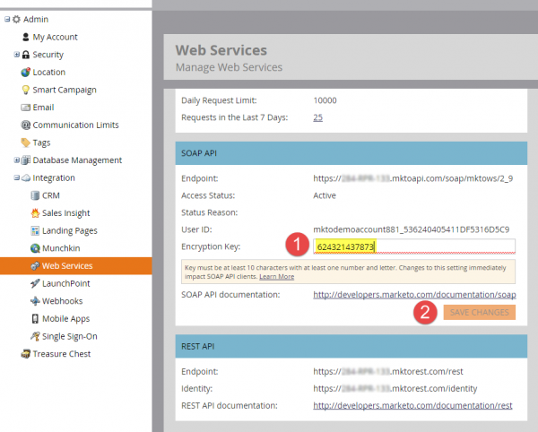

<InlineAlert slots="text" variant="warning" />

The SOAP API is deprecated and will reach end of life on July 31, 2026. All new integrations should be developed using the [Marketo REST API](../rest-api/rest-api.md), and existing integrations should be migrated before that date.

# SOAP API

The SOAP API is being deprecated and will no longer be available after July 31st 2026. All new development should be done with the Marketo [REST API](../rest-api/rest-api.md), and existing services should be migrated by that date to avoid interruptions in service. If you have a service which uses the SOAP API, please consult the SOAP API [Migration Guide](./migration.md) for information on how to migrate.

## SOAP WSDL

To retrieve the SOAP WSDL document, obtain your SOAP API Endpoint from your **Admin** > **Integration** > **Web Services** menu.

Your WSDL URL is:

`<SOAP API Endpoint> + ?WSDL`

Do not use the end point defined in the WSDL. Each Marketo instance has a unique end point in which to make calls to.

## Limits

- **Daily Quota:** Most subscriptions are allocated 10,000 API calls per day (which resets daily at 12:00AM CST). You can increase your daily quota through your account manager.
- **Rate Limit:** API access per instance limited to 100 calls per 20 seconds.
- **Concurrency Limit:**  Maximum of ten concurrent API calls.

Our recommendation is that batch sizes are no larger than 300. Larger sizes are not supported and may result in timeouts, and in extreme cases being throttled.

## SOAP API settings in Marketo

1. Go to the **Admin** section and select **Web Services**.

1. Set an appropriate **Encryption Key**, select **Save Changes** and use the SOAP API **Endpoint**, **User ID**, and **Encryption Key** values to generate the correct [authentication signature](authentication-signature.md) for each SOAP API call.

