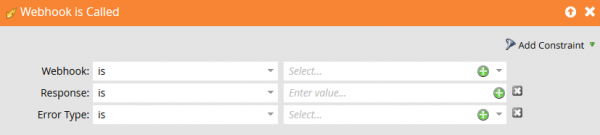

# Errors

This page describes error response codes for Marketo webhooks and explains how to handle webhook errors.

Marketo generates error codes 1000 and 1001. The system called by the Marketo webhook returns 2xx through 5xx response codes.

Marketo maps response values to a field only when the web service returns a 2xx response code. If a webhook response is intended to change values in a Marketo lead record, all other response codes cause Marketo to ignore the response for field updates.

| Response Code | Description |
| --- | --- |
| 1000 | This indicates that the 'Call Webhook' flow action is being housed within a Batch Campaign. Webhooks can only be fired from trigger campaigns. |
| 1001 | This indicates that the web service emitted an empty response body. |

## Catching a Webhook Error

Use the **Webhook is Called** trigger to catch and handle webhook errors:

* **Response** - The literal response payload received by the request.
* **Error Type** - The Reason-Phrase of the HTTP status message.

Use these values to respond to predictable errors and exceptions. Depending on the integrated service, you can automatically recover from some error classes and create alerts for unexpected errors.
