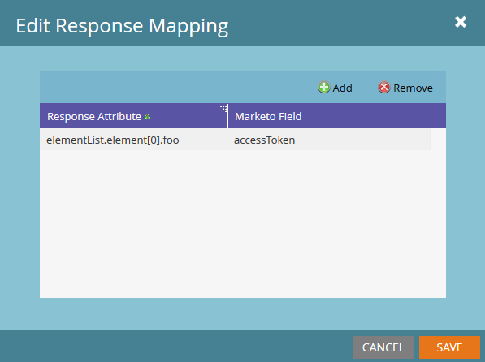

# Response Mappings

Marketo can translate webhook data from JSON or XML and write the values to lead fields. The Marketo Field parameter always uses the field's SOAP API name.

Each webhook can have an unlimited number of response mappings. To add or edit mappings, select **Edit** in the webhook's Response Mappings pane:



A response mapping pairs these values:

- "Response Attribute": The path to the desired property in the XML or JSON document.
- "Marketo Field": The lead field to which Marketo writes the Response Attribute value.

To access a property through Marketo response mappings, its key must contain only alphanumeric characters, dash (-), underscore(_), colon (:), and whitespace.

## JSON Mappings

Access JSON properties with dot notation and array notation. Marketo array notation accepts only integers, not strings.

To retrieve data from a JSON document, set the response type to JSON:

```json
{ "foo":"bar"}
```

The `foo` property is at the first level of the JSON object. Use its property `name`, `foo`, in the response mapping:


The following example contains an array:

```json
{
    "profileId" : 1234,
    "firstName" : "Jane",
    "lastName" : "Doe",
    "orders" : [
        {
            "orderId" : 5678,
            "orderDate" : "2015-01-01",
            "orderProductId" : "4982"
        },
        {
            "orderId" : 5678,
            "orderDate" : "2014-05-07",
            "orderProductId" : "4982"
        }
    ]
}
```

To access orderDate from the first element of the orders array, use `orders[0].orderDate`.

## XML Mappings

Access values from individual XML elements by using dot notation, similar to JSON mappings. Consider this example:

```xml
<?xml version="1.0" encoding="UTF-8"?>
<example>
    <foo>bar</foo>
</example>
```

To access the foo property, use `example.foo`.

Reference the example element before accessing `foo`. A mapping must reference every element in the property hierarchy.

For an XML document with an array, consider this example:

```xml
<?xml version="1.0" encoding="UTF-8"?>
<elementList>
    <element>
        <foo>baz</foo>
    </element>
    <element>
        <foo>bar</foo>
    </element>
    <element>
        <foo>bar</foo>
    </element>
</elementList>
```

The parent array is `elementList`. Each child element contains the `foo` property. Marketo response mappings reference the array as `elementList.element` and access its children through `elementList.element[i]`.

To get the value of foo from the first child of elementList, use the response attribute `elementList.element[0].foo`. This mapping returns the value "baz" to the designated field.

Accessing properties inside elements that contain both unique and non-unique element names produces undefined behavior. Each element must be either a single property or an array. Do not mix the types.

## Types

When mapping attributes to fields, ensure that the webhook response type is compatible with the target field. For example, Marketo does not write a string response value to a field of type integer. For more information, see [Field Types](../rest-api/field-types.md).
