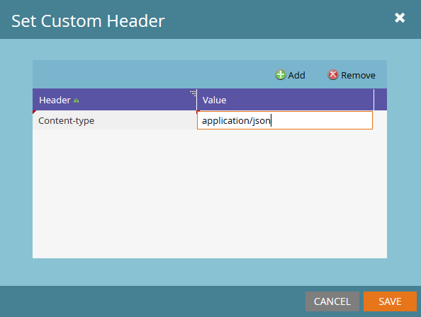

# Webhooks

Marketo allows the use of Webhooks to communicate with third-party web services. Webhooks support the use of the GET or POST HTTP verbs to push or retrieve data from a specific URL. For detailed instructions on in-application creation of Webhooks and how to add them to Smart Campaigns, refer to the following articles:

- [Create a Webhook](https://experienceleague.adobe.com/en/docs/marketo/using/product-docs/administration/additional-integrations/create-a-webhook)
- [Call Webhook](https://experienceleague.adobe.com/en/docs/marketo/using/product-docs/core-marketo-concepts/smart-campaigns/flow-actions/call-webhook)
- [Use a Webhook in a Smart Campaign](https://experienceleague.adobe.com/en/docs/marketo/using/product-docs/core-marketo-concepts/smart-campaigns/flow-actions/use-a-webhook-in-a-smart-campaign)

Each individual webhook has the following properties:

- **URL** - Enter the URL that you use to submit your request to the web service.
- **Request Type** - The HTTP method.
- **Payload Template** - If you wish to transmit information in the body of the POST, enter the template. Use any data format that supports HTTP POST, including XML, JSON, or SOAP. The serialization format must allow double quotes around strings. To insert a token in your template, select **Insert Token**. String-type tokens are automatically enclosed in double quotes.
- **Request Token Encoding** - If the token values include special characters (such as an ampersand, '&'), indicate the format of your request (JSON or Form/Url). The correct encoding should be selected for the body to ensure that the Webhook communicates with the web service correctly.
- **Response Type** - Select the format of the response that you receive from the service (JSON or XML). The correct response type must be selected to map properties of the response back to lead fields in Marketo.
- **Custom Headers** - Accessed through **Webhooks Actions** > **Set Custom Header**, this menu allows the addition of any number of custom Key-Value pairs as HTTP Headers.

Data can be written back to leads from web-service responses by using [Response Mappings](response-mappings.md).

## Tokens

All outgoing fields in a Webhook (URL, Template, and Custom Headers) populate the content of tokens in the same context of the flow step. This means that Lead and System tokens are always available, while Trigger, Campaign, and Program tokens are available in their respective scopes. See token-related articles:

- [Tokens Overview](https://experienceleague.adobe.com/en/docs/marketo/using/product-docs/demand-generation/landing-pages/personalizing-landing-pages/tokens-overview)
- [System Tokens Glossary](https://experienceleague.adobe.com/en/docs/marketo/using/product-docs/email-marketing/general/using-tokens/system-tokens-glossary)
- [Tokens for Interesting Moments](https://experienceleague.adobe.com/en/docs/marketo/using/product-docs/marketo-sales-insight/msi-for-salesforce/features/tabs-in-the-msi-panel/interesting-moments/trigger-tokens-for-interesting-moments)

A common case for this is when a Program or Campaign is explicitly mapped to a third-party resource. An ID can be set at the program level as a `My Token`, and then passed into the Webhook request as a token.

## Custom Headers

Webhooks allow the usage of any number of Custom Header fields to be sent along with the outgoing request. These can be added through **Webhooks Actions** > **Set Custom Header**. Each header is recorded as a simple Key-Value pair. Tokens can be used in this area.

## Tips

- The Call Webhook flow step is only valid in Trigger campaigns.
- Updates via response mappings will only occur if the web service responds with a 2xx HTTP response code. Other types of codes will not result in updates to the record.
- You can use web services to perform custom data enrichment, validation, or normalization from internal or external services.
- Webhook execution time is at the mercy of the response time of the service being used and can result in long campaign execution delays. Even if a service only takes 50ms to execute, that is 1.5 hours when executed 100,000 times.
- Marketo waits up to 30 seconds for a given service call before terminating the call (also known as timing out).
- Characters embedded in the URL field are passed as written, for example '&' is sent as '&', '%26' is sent as '%26'
  - If a character should be percent-encoded when received by the recipient server, it should be passed explicitly as the string representing that character
